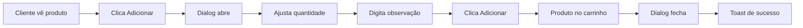

# ✅ Adição: Campo de Observação ao Adicionar Produto

**Data:** 29/10/2025  
**Branch:** `bugfix/analise-erros-logica`  
**Problema:** Campo de observação sumiu ao adicionar produtos ao carrinho

---

## 🎯 Requisito

Cliente precisa poder adicionar **observações** ao adicionar um produto ao carrinho, como:
- "Sem gelo"
- "Sem cebola"
- "Ponto da carne: mal passada"
- "Sem molho"
- "Com limão"

---

## 🐛 Problema Anterior

O fluxo antigo adicionava o produto **diretamente** ao carrinho sem permitir personalização:

```typescript
// ANTES
const handleAddToCart = (produto: Produto) => {
  setCarrinho([...carrinho, { 
    produtoId: produto.id,
    quantidade: 1,
    observacao: '' // ❌ Sempre vazio
  }]);
};
```

---

## ✅ Solução Implementada

### 1. **Novo Componente: AddProdutoDialog**

Criado dialog modal que abre ao clicar em "Adicionar":

```typescript:frontend/src/components/cardapio/AddProdutoDialog.tsx
export function AddProdutoDialog({
  produto,
  open,
  onClose,
  onAdd,
}: AddProdutoDialogProps) {
  const [quantidade, setQuantidade] = useState(1);
  const [observacao, setObservacao] = useState('');

  const handleAdd = () => {
    onAdd(quantidade, observacao);
    handleClose();
  };

  return (
    <Dialog open={open} onOpenChange={handleClose}>
      {/* Imagem e info do produto */}
      
      {/* Controle de quantidade */}
      <div className="flex items-center gap-3">
        <Button onClick={() => setQuantidade(quantidade - 1)}>
          <Minus />
        </Button>
        <span>{quantidade}</span>
        <Button onClick={() => setQuantidade(quantidade + 1)}>
          <Plus />
        </Button>
      </div>

      {/* Campo de observações */}
      <Textarea
        placeholder="Ex: Sem gelo, sem cebola, ponto da carne, etc."
        value={observacao}
        onChange={(e) => setObservacao(e.target.value)}
        maxLength={200}
      />

      <Button onClick={handleAdd}>
        Adicionar ao Carrinho
      </Button>
    </Dialog>
  );
}
```

### 2. **Modificação no CardapioClientPage**

```typescript:frontend/src/app/(cliente)/cardapio/[comandaId]/CardapioClientPage.tsx
// Estado para controlar o produto selecionado
const [produtoSelecionado, setProdutoSelecionado] = useState<Produto | null>(null);

// Ao clicar em adicionar, abre o dialog
const handleAddToCart = (produto: Produto) => {
  setProdutoSelecionado(produto);
};

// Confirma adição com quantidade e observação
const handleConfirmAdd = (quantidade: number, observacao: string) => {
  if (!produtoSelecionado) return;
  
  toast.success(`${produtoSelecionado.nome} adicionado ao carrinho!`);
  setCarrinho([
    ...carrinho,
    { 
      produtoId: produtoSelecionado.id, 
      produtoNome: produtoSelecionado.nome, 
      preco: produtoSelecionado.preco, 
      quantidade,        // ✅ Quantidade personalizada
      observacao         // ✅ Observação personalizada
    }
  ]);
  setProdutoSelecionado(null);
};

// Renderizar o dialog
<AddProdutoDialog
  produto={produtoSelecionado}
  open={!!produtoSelecionado}
  onClose={() => setProdutoSelecionado(null)}
  onAdd={handleConfirmAdd}
/>
```

---

## 🎨 Interface do Dialog

### Elementos Visuais

1. **Imagem do Produto** (se disponível)
2. **Nome e Descrição**
3. **Preço Unitário**
4. **Controle de Quantidade** (- / número / +)
5. **Campo de Observações** (textarea com limite de 200 caracteres)
6. **Subtotal Calculado** (preço × quantidade)
7. **Botões:** Cancelar / Adicionar ao Carrinho

### Exemplo Visual

```
┌─────────────────────────────────────┐
│  Adicionar ao Pedido                │
├─────────────────────────────────────┤
│  [Imagem]  Coca-Cola Lata 350ml     │
│            Refrigerante gelado       │
│            R$ 6,00                   │
│                                      │
│  Quantidade:  [-]  1  [+]            │
│                                      │
│  Observações (opcional):             │
│  ┌─────────────────────────────────┐│
│  │ Sem gelo                        ││
│  └─────────────────────────────────┘│
│  8/200 caracteres                    │
│                                      │
│  Subtotal: R$ 6,00                   │
│                                      │
│  [Cancelar]  [Adicionar ao Carrinho]│
└─────────────────────────────────────┘
```

---

## 🔄 Fluxo Completo



---

## 📊 Comparação

### Antes (Sem Observação)

| Ação | Comportamento |
|------|---------------|
| Clicar "Adicionar" | ❌ Adiciona direto (quantidade = 1) |
| Personalizar | ❌ Não permite |
| Observação | ❌ Sempre vazia |

### Depois (Com Observação)

| Ação | Comportamento |
|------|---------------|
| Clicar "Adicionar" | ✅ Abre dialog |
| Personalizar | ✅ Quantidade + Observação |
| Observação | ✅ Até 200 caracteres |

---

## 🧪 Como Testar

### Teste 1: Adicionar com Observação
```bash
1. Acessar: http://localhost:3001/cardapio/{comandaId}
2. Clicar em "Adicionar" em um produto
3. ✅ Dialog deve abrir
4. Ajustar quantidade para 2
5. Digitar "Sem gelo" na observação
6. Clicar "Adicionar ao Carrinho"
7. ✅ Toast: "Produto adicionado ao carrinho!"
8. Abrir carrinho
9. ✅ Verificar: 2x Produto, "Obs: Sem gelo"
```

### Teste 2: Adicionar sem Observação
```bash
1. Clicar em "Adicionar" em um produto
2. Deixar observação vazia
3. Clicar "Adicionar ao Carrinho"
4. ✅ Deve adicionar normalmente
5. No carrinho, não deve mostrar "Obs:"
```

### Teste 3: Cancelar Adição
```bash
1. Clicar em "Adicionar"
2. Digitar observação
3. Clicar "Cancelar"
4. ✅ Dialog fecha sem adicionar
5. ✅ Carrinho não muda
```

### Teste 4: Limite de Caracteres
```bash
1. Clicar em "Adicionar"
2. Digitar mais de 200 caracteres
3. ✅ Deve bloquear em 200
4. ✅ Contador mostra "200/200"
```

---

## 📝 Arquivos Criados/Modificados

### Criados
1. `frontend/src/components/cardapio/AddProdutoDialog.tsx` (novo)

### Modificados
1. `frontend/src/app/(cliente)/cardapio/[comandaId]/CardapioClientPage.tsx`
   - Adicionado estado `produtoSelecionado`
   - Modificado `handleAddToCart` para abrir dialog
   - Adicionado `handleConfirmAdd` para confirmar adição
   - Renderizado `AddProdutoDialog`

---

## 🎯 Benefícios

1. **✅ Melhor UX:** Cliente pode personalizar antes de adicionar
2. **✅ Menos Erros:** Revisa quantidade e observação antes de confirmar
3. **✅ Mais Controle:** Pode ajustar quantidade sem ir ao carrinho
4. **✅ Comunicação Clara:** Observações chegam direto para a cozinha/bar

---

## 🔮 Melhorias Futuras (Opcional)

1. **Opções Pré-definidas:** Checkboxes para "Sem gelo", "Sem cebola", etc.
2. **Complementos:** Adicionar extras pagos (ex: bacon +R$3)
3. **Favoritos:** Salvar observações frequentes
4. **Histórico:** Sugerir observações anteriores do cliente

---

## 📚 Documentação Relacionada

- `CORRECAO_LOGICA_AGREGADOS.md` - Correção de agregados
- `CORRECAO_BOTOES_MESA.md` - Correção dos botões após confirmar mesa

---

**Status:** ✅ Implementado e Pronto para Teste  
**Impacto:** 🔥 Alto - Funcionalidade essencial para personalização  
**Complexidade:** ⭐⭐ Média - Novo componente + integração
