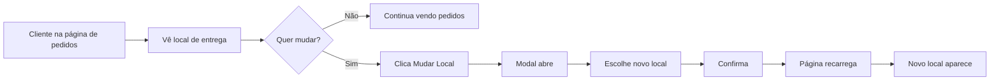

# ✅ Adição: Exibição do Local de Entrega na Página de Pedidos

**Data:** 29/10/2025  
**Branch:** `bugfix/analise-erros-logica`  
**Requisito:** Mostrar onde o pedido será entregue com opção de mudar o local

---

## 🎯 Objetivo

Na página de **acompanhamento de pedidos** (`/acesso-cliente/[comandaId]`), o cliente precisa ver:
1. **Onde seus pedidos serão entregues** (Mesa ou Ponto de Entrega)
2. **Botão para mudar o local** se necessário

---

## 🎨 Interface Implementada

### Seção de Local de Entrega

```
┌─────────────────────────────────────────┐
│ 📦 Local de Entrega                     │
│                                          │
│ Seus pedidos serão entregues em:        │
│                                          │
│ ┌─────────────────────────────────────┐ │
│ │ Mesa 5                              │ │
│ └─────────────────────────────────────┘ │
│                                          │
│ [🔄 Mudar Local de Entrega]             │
└─────────────────────────────────────────┘
```

### Cores e Estilo

- **Fundo:** Azul claro (`bg-blue-50`)
- **Borda:** Azul (`border-blue-200`)
- **Ícone:** 📦 + MapPin
- **Botão:** Outline com ícone RefreshCw

---

## 📝 Implementação

### Modificações em `page.tsx`

```typescript:frontend/src/app/(cliente)/acesso-cliente/[comandaId]/page.tsx
import { useState } from 'react';
import { MapPin, RefreshCw } from 'lucide-react';
import { MudarLocalModal } from '@/components/pontos-entrega/MudarLocalModal';

export default function ComandaClientePage() {
    const [isLocalModalOpen, setIsLocalModalOpen] = useState(false);

    return (
        <CardContent>
            {/* Seção de Local de Entrega */}
            {(comanda.mesa || comanda.pontoEntrega) && (
                <div className="mb-6 p-4 bg-blue-50 border-2 border-blue-200 rounded-lg">
                    <div className="flex items-start gap-3">
                        <MapPin className="w-6 h-6 text-blue-600 mt-0.5 flex-shrink-0" />
                        <div className="flex-1">
                            <h4 className="font-bold text-blue-900 text-base mb-1">
                                📦 Local de Entrega
                            </h4>
                            <p className="text-blue-800 text-sm mb-2">
                                Seus pedidos serão entregues em:
                            </p>
                            <div className="bg-white rounded-md p-3 border border-blue-300 mb-3">
                                <p className="font-bold text-blue-900 text-lg">
                                    {comanda.mesa 
                                        ? `Mesa ${comanda.mesa.numero}` 
                                        : comanda.pontoEntrega?.nome
                                    }
                                </p>
                                {comanda.pontoEntrega?.descricao && (
                                    <p className="text-sm text-gray-600 mt-1">
                                        {comanda.pontoEntrega.descricao}
                                    </p>
                                )}
                            </div>
                            <Button
                                variant="outline"
                                size="sm"
                                onClick={() => setIsLocalModalOpen(true)}
                                className="w-full"
                            >
                                <RefreshCw className="w-4 h-4 mr-2" />
                                Mudar Local de Entrega
                            </Button>
                        </div>
                    </div>
                </div>
            )}

            {/* Modal para mudar local */}
            {comandaId && (
                <MudarLocalModal
                    comandaId={comandaId}
                    pontoAtualId={comanda.pontoEntrega?.id}
                    mesaAtualId={comanda.mesa?.id}
                    agregadosAtuais={comanda.agregados}
                    open={isLocalModalOpen}
                    onOpenChange={setIsLocalModalOpen}
                    onSuccess={async () => {
                        console.log('✅ Local alterado, recarregando...');
                        window.location.reload();
                    }}
                />
            )}
        </CardContent>
    );
}
```

---

## 🔄 Fluxo de Uso



---

## 📊 Casos de Uso

### Caso 1: Mesa
```
Local de Entrega: Mesa 5
Botão: Mudar Local de Entrega
```

### Caso 2: Ponto de Entrega
```
Local de Entrega: Balcão Principal
Descrição: Próximo ao bar
Botão: Mudar Local de Entrega
```

### Caso 3: Sem Local Definido
```
(Seção não aparece)
```

---

## 🎯 Benefícios

1. **✅ Transparência:** Cliente sabe exatamente onde buscar o pedido
2. **✅ Flexibilidade:** Pode mudar se mudou de lugar
3. **✅ Menos Confusão:** Evita pedidos perdidos
4. **✅ Melhor UX:** Informação clara e acessível

---

## 🧪 Como Testar

### Teste 1: Ver Local de Mesa
```bash
1. Acessar: http://localhost:3001/acesso-cliente/{comandaId}
2. ✅ Deve mostrar seção azul com "Local de Entrega"
3. ✅ Deve mostrar "Mesa X"
4. ✅ Botão "Mudar Local de Entrega" presente
```

### Teste 2: Ver Local de Ponto de Entrega
```bash
1. Comanda com ponto de entrega
2. Acessar página de pedidos
3. ✅ Deve mostrar nome do ponto
4. ✅ Se tiver descrição, deve aparecer
```

### Teste 3: Mudar Local
```bash
1. Clicar "Mudar Local de Entrega"
2. ✅ Modal abre
3. Escolher novo local
4. Confirmar
5. ✅ Página recarrega
6. ✅ Novo local aparece na seção
```

### Teste 4: Sem Local Definido
```bash
1. Comanda sem mesa e sem ponto
2. Acessar página de pedidos
3. ✅ Seção de local NÃO deve aparecer
```

---

## 📝 Arquivos Modificados

1. `frontend/src/app/(cliente)/acesso-cliente/[comandaId]/page.tsx`
   - Adicionado import `MapPin`, `RefreshCw`
   - Adicionado import `MudarLocalModal`
   - Adicionado estado `isLocalModalOpen`
   - Adicionada seção de local de entrega
   - Adicionado modal `MudarLocalModal`

---

## 🎨 Design System

### Cores
- **Fundo:** `bg-blue-50`
- **Borda:** `border-blue-200`
- **Texto Título:** `text-blue-900`
- **Texto Descrição:** `text-blue-800`
- **Card Interno:** `bg-white` + `border-blue-300`

### Ícones
- **MapPin:** Localização (azul)
- **RefreshCw:** Atualizar/Mudar

### Espaçamento
- **Padding:** `p-4`
- **Gap:** `gap-3`
- **Margin Bottom:** `mb-6`

---

## 🔮 Melhorias Futuras (Opcional)

1. **Histórico de Locais:** Mostrar locais anteriores
2. **Notificação de Mudança:** Avisar garçom quando cliente muda de local
3. **Sugestão Inteligente:** Sugerir local baseado em pedidos anteriores
4. **Mapa Visual:** Mostrar mapa do estabelecimento com localização

---

## 📚 Documentação Relacionada

- `CORRECAO_LOGICA_AGREGADOS.md` - Lógica de agregados
- `CORRECAO_BOTOES_MESA.md` - Botões após confirmar mesa
- `ADICAO_CAMPO_OBSERVACAO.md` - Campo de observação

---

## 🔗 Integração

Esta funcionalidade se integra com:
- ✅ `MudarLocalModal` - Modal para mudar local
- ✅ `useComandaSubscription` - Hook de dados da comanda
- ✅ Sistema de pontos de entrega
- ✅ Sistema de mesas

---

**Status:** ✅ Implementado e Pronto para Teste  
**Impacto:** 🔥 Alto - Melhora significativa na UX  
**Complexidade:** ⭐ Baixa - Apenas exibição e integração
