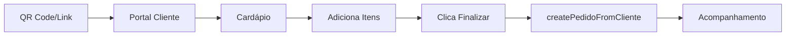
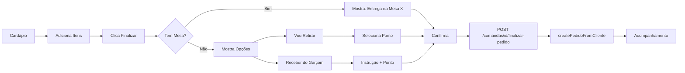

# 📋 Análise: Funcionalidade de Seleção de Método de Entrega

**Data:** 29/10/2025  
**Branch Base:** `bugfix/analise-erros-logica`  
**Objetivo:** Implementar tela de seleção de método de entrega para clientes

---

## 🎯 Requisito Funcional

### História de Usuário
```
Como um: Cliente com itens no carrinho
Eu quero: Revisar meu pedido e escolher de forma clara como quero recebê-lo
Para que: O sistema saiba exatamente qual é a minha intenção de entrega

Opções de Entrega:
- 🪑 MESA: Cliente veio de QR Code de mesa (automático)
- 🚶 RETIRAR: Cliente vai buscar no balcão/ponto de retirada
- 🍽️ GARCOM: Garçom entrega na localização do cliente
```

### Critérios de Aceite
1. ✅ **[UI]** Exibir resumo claro do pedido (itens e total)
2. ✅ **[Lógica]** Verificar se cliente veio de QR Code de mesa
3. ✅ **[UI]** Se mesa: informar entrega na mesa (sem seleção)
4. ✅ **[UI]** Se avulso: apresentar opções "Vou Retirar" e "Receber do Garçom"
5. ✅ **[Lógica]** Se "Vou Retirar": exibir lista de Pontos de Retirada
6. ✅ **[Lógica]** Se "Receber do Garçom": campo texto + lista de pontos (fallback)
7. ✅ **[API]** Chamar endpoint com dados corretos
8. ✅ **[Redirecionamento]** Ir para `/acesso-cliente/{id}` após confirmação

---

## 🏗️ Arquitetura Atual

### Backend (NestJS)

#### 📂 Estrutura de Módulos
```
backend/src/modulos/
├── comanda/
│   ├── comanda.controller.ts    ← Adicionar endpoint aqui
│   ├── comanda.service.ts       ← Adicionar método aqui
│   ├── dto/
│   │   └── finalizar-pedido.dto.ts ← ✅ JÁ CRIADO
│   └── entities/
│       └── comanda.entity.ts    ← Tem relação com Mesa
├── pedido/
│   ├── pedido.controller.ts     ← POST /pedidos/cliente (já existe)
│   └── pedido.service.ts        ← create() já implementado
├── ambiente/
│   ├── ambiente.controller.ts   ← GET /ambientes (protegido)
│   └── ambiente.service.ts      ← findAll() já existe
└── mesa/
    └── entities/mesa.entity.ts  ← Relacionamento com Comanda
```

#### 🔑 Entidades Principais

**Comanda** (`comanda.entity.ts`)
```typescript
@Entity()
export class Comanda {
  @PrimaryGeneratedColumn('uuid')
  id: string;

  @ManyToOne(() => Mesa, { nullable: true, eager: true })
  mesa: Mesa;  // ← SE EXISTE = Cliente de mesa

  @ManyToOne(() => Cliente, { nullable: true, eager: true })
  cliente: Cliente;

  @Column({ type: 'enum', enum: ComandaStatus })
  status: ComandaStatus;
}
```

**Pedido** (`pedido.entity.ts`)
```typescript
@Entity()
export class Pedido {
  @ManyToOne(() => Comanda)
  comanda: Comanda;

  @OneToMany(() => ItemPedido)
  itens: ItemPedido[];

  @Column('decimal', { precision: 10, scale: 2 })
  total: number;

  @Column({ type: 'enum', enum: PedidoStatus })
  status: PedidoStatus;
}
```

#### 🛣️ Rotas Existentes

| Método | Rota | Acesso | Descrição |
|--------|------|--------|-----------|
| POST | `/pedidos/cliente` | 🌐 Público | Cria pedido do cliente |
| GET | `/comandas/:id/public` | 🌐 Público | Busca dados da comanda |
| GET | `/ambientes` | 🔒 Protegido | Lista ambientes (ADMIN) |

#### ⚠️ Problema Identificado
- **Ambientes não tem rota pública** → Cliente não consegue buscar pontos de retirada
- **Não existe endpoint de finalização** → Precisa criar

---

### Frontend (Next.js)

#### 📂 Estrutura de Páginas
```
frontend/src/app/(cliente)/
├── cardapio/[comandaId]/
│   ├── CardapioClientPage.tsx   ← Ponto de partida
│   └── finalizar/               ← ❌ NÃO EXISTE (criar)
│       └── page.tsx
└── acesso-cliente/[comandaId]/
    └── page.tsx                 ← Destino final (já existe)
```

#### 🔄 Fluxo Atual do Cliente



#### 📝 Código Atual - CardapioClientPage.tsx

```typescript:frontend/src/app/(cliente)/cardapio/[comandaId]/CardapioClientPage.tsx#80-104
const handleFinalizarPedido = async () => {
  if (carrinho.length === 0) {
    toast.info("O seu carrinho está vazio.");
    return;
  }

  setIsLoading(true);
  const itens: CreateItemPedidoDto[] = carrinho.map(item => ({
    produtoId: item.produtoId,
    quantidade: item.quantidade,
    observacao: item.observacao,
  }));

  try {
    await createPedidoFromCliente({ comandaId: comanda.id, itens });
    toast.success("Pedido enviado para preparo!");
    setCarrinho([]);
    setIsCarrinhoOpen(false);
    router.push(`/acesso-cliente/${comanda.id}`);
  } catch (error) {
    toast.error("Falha ao enviar o pedido. Tente novamente.");
  } finally {
    setIsLoading(false);
  }
};
```

**Problema:** Envia pedido direto, sem perguntar método de entrega!

---

## 🎨 Novo Fluxo Proposto



---

## 📦 Implementação Necessária

### 1️⃣ Backend (3 arquivos)

#### A. Criar DTO (✅ JÁ FEITO)
```typescript:backend/src/modulos/comanda/dto/finalizar-pedido.dto.ts
export enum MetodoEntrega {
  RETIRAR = 'RETIRAR',
  GARCOM = 'GARCOM',
  MESA = 'MESA',
}

export class FinalizarPedidoDto {
  @IsEnum(MetodoEntrega)
  metodoEntrega: MetodoEntrega;

  @IsUUID()
  @IsOptional()
  pontoRetiradaId?: string;

  @IsString()
  @IsOptional()
  instrucaoEntrega?: string;
}
```

#### B. Adicionar Endpoint no Controller
```typescript:backend/src/modulos/comanda/comanda.controller.ts
// Adicionar após linha 103

@Public()
@Post(':id/finalizar-pedido')
@ApiOperation({ summary: 'Registra método de entrega escolhido pelo cliente' })
@ApiResponse({ status: 200, description: 'Método registrado com sucesso.' })
finalizarPedido(
  @Param('id', ParseUUIDPipe) id: string,
  @Body() finalizarPedidoDto: FinalizarPedidoDto,
) {
  return this.comandaService.finalizarPedido(id, finalizarPedidoDto);
}
```

**Imports necessários:**
```typescript
import { FinalizarPedidoDto } from './dto/finalizar-pedido.dto';
```

#### C. Adicionar Método no Service
```typescript:backend/src/modulos/comanda/comanda.service.ts
// Adicionar antes do último }

async finalizarPedido(
  id: string, 
  dto: FinalizarPedidoDto
): Promise<{ success: boolean; message: string }> {
  const comanda = await this.findOne(id);
  
  if (!comanda) {
    throw new NotFoundException(`Comanda ${id} não encontrada.`);
  }

  // Log para rastreamento
  this.logger.log(
    `Pedido finalizado | Comanda: ${id} | Método: ${dto.metodoEntrega}`
  );
  
  if (dto.pontoRetiradaId) {
    this.logger.log(`Ponto de retirada: ${dto.pontoRetiradaId}`);
  }
  
  if (dto.instrucaoEntrega) {
    this.logger.log(`Instrução: ${dto.instrucaoEntrega}`);
  }

  // Emitir atualização via WebSocket
  this.pedidosGateway.emitComandaAtualizada(comanda);

  return {
    success: true,
    message: 'Método de entrega registrado! Aguarde a preparação.',
  };
}
```

**Import necessário:**
```typescript
import { FinalizarPedidoDto } from './dto/finalizar-pedido.dto';
```

#### D. Criar Rota Pública para Ambientes
```typescript:backend/src/modulos/ambiente/ambiente.controller.ts
// Adicionar após linha 48

@Public()
@Get('public')
@ApiOperation({ summary: 'Lista ambientes (rota pública para clientes)' })
@ApiResponse({ status: 200, description: 'Lista de ambientes.' })
findAllPublic() {
  return this.ambienteService.findAll();
}
```

**Import necessário:**
```typescript
import { Public } from 'src/auth/decorators/public.decorator';
```

---

### 2️⃣ Frontend (4 arquivos)

#### A. Adicionar Função no comandaService.ts
```typescript:frontend/src/services/comandaService.ts
// Adicionar no final do arquivo

export interface FinalizarPedidoDto {
  metodoEntrega: 'RETIRAR' | 'GARCOM' | 'MESA';
  pontoRetiradaId?: string;
  instrucaoEntrega?: string;
}

export const finalizarPedido = async (
  comandaId: string,
  dados: FinalizarPedidoDto
): Promise<{ success: boolean; message: string }> => {
  const response = await api.post(
    `/comandas/${comandaId}/finalizar-pedido`,
    dados
  );
  return response.data;
};
```

#### B. Adicionar Função Pública no ambienteService.ts
```typescript:frontend/src/services/ambienteService.ts
// Adicionar após linha 23

export const getAmbientesPublic = async (): Promise<AmbienteData[]> => {
  const response = await api.get<AmbienteData[]>('/ambientes/public');
  return response.data;
};
```

#### C. Modificar CardapioClientPage.tsx
```typescript:frontend/src/app/(cliente)/cardapio/[comandaId]/CardapioClientPage.tsx
// Substituir handleFinalizarPedido (linhas 80-104)

const handleFinalizarPedido = async () => {
  if (carrinho.length === 0) {
    toast.info("O seu carrinho está vazio.");
    return;
  }

  // Salvar carrinho no sessionStorage
  sessionStorage.setItem('carrinho-temp', JSON.stringify(carrinho));
  
  // Redirecionar para página de seleção de entrega
  router.push(`/cardapio/${comanda.id}/finalizar`);
};
```

#### D. Criar Nova Página: finalizar/page.tsx
```typescript:frontend/src/app/(cliente)/cardapio/[comandaId]/finalizar/page.tsx
'use client';

import { useEffect, useState } from 'react';
import { useParams, useRouter } from 'next/navigation';
import { Button } from '@/components/ui/button';
import { Card } from '@/components/ui/card';
import { Textarea } from '@/components/ui/textarea';
import { RadioGroup, RadioGroupItem } from '@/components/ui/radio-group';
import { Label } from '@/components/ui/label';
import { toast } from 'sonner';
import { getComandaPublic } from '@/services/comandaService';
import { getAmbientesPublic } from '@/services/ambienteService';
import { finalizarPedido } from '@/services/comandaService';
import { createPedidoFromCliente } from '@/services/pedidoService';

export default function FinalizarPedidoPage() {
  const params = useParams();
  const router = useRouter();
  const comandaId = Array.isArray(params.comandaId) 
    ? params.comandaId[0] 
    : params.comandaId;

  const [comanda, setComanda] = useState<any>(null);
  const [carrinho, setCarrinho] = useState<any[]>([]);
  const [ambientes, setAmbientes] = useState<any[]>([]);
  const [metodoEntrega, setMetodoEntrega] = useState<string>('');
  const [pontoRetiradaId, setPontoRetiradaId] = useState<string>('');
  const [instrucaoEntrega, setInstrucaoEntrega] = useState<string>('');
  const [isLoading, setIsLoading] = useState(false);

  useEffect(() => {
    const carregarDados = async () => {
      try {
        // Carregar comanda
        const comandaData = await getComandaPublic(comandaId);
        setComanda(comandaData);

        // Carregar carrinho do sessionStorage
        const carrinhoTemp = sessionStorage.getItem('carrinho-temp');
        if (carrinhoTemp) {
          setCarrinho(JSON.parse(carrinhoTemp));
        } else {
          toast.error('Carrinho vazio!');
          router.push(`/cardapio/${comandaId}`);
          return;
        }

        // Carregar ambientes
        const ambientesData = await getAmbientesPublic();
        setAmbientes(ambientesData);

        // Se tem mesa, define método automaticamente
        if (comandaData.mesa) {
          setMetodoEntrega('MESA');
        }
      } catch (error) {
        toast.error('Erro ao carregar dados');
        router.push(`/cardapio/${comandaId}`);
      }
    };

    carregarDados();
  }, [comandaId, router]);

  const calcularTotal = () => {
    return carrinho.reduce(
      (total, item) => total + item.preco * item.quantidade,
      0
    );
  };

  const handleConfirmar = async () => {
    // Validações
    if (!metodoEntrega) {
      toast.error('Selecione um método de entrega');
      return;
    }

    if (metodoEntrega === 'RETIRAR' && !pontoRetiradaId) {
      toast.error('Selecione um ponto de retirada');
      return;
    }

    setIsLoading(true);

    try {
      // 1. Registrar método de entrega
      await finalizarPedido(comandaId, {
        metodoEntrega: metodoEntrega as any,
        pontoRetiradaId: pontoRetiradaId || undefined,
        instrucaoEntrega: instrucaoEntrega || undefined,
      });

      // 2. Criar pedido
      const itens = carrinho.map(item => ({
        produtoId: item.produtoId,
        quantidade: item.quantidade,
        observacao: item.observacao,
      }));

      await createPedidoFromCliente({ comandaId, itens });

      // 3. Limpar sessionStorage
      sessionStorage.removeItem('carrinho-temp');

      toast.success('Pedido enviado com sucesso!');
      router.push(`/acesso-cliente/${comandaId}`);
    } catch (error) {
      toast.error('Erro ao finalizar pedido');
    } finally {
      setIsLoading(false);
    }
  };

  if (!comanda || carrinho.length === 0) {
    return <div className="p-4">Carregando...</div>;
  }

  return (
    <div className="p-4 max-w-2xl mx-auto">
      <h1 className="text-2xl font-bold mb-4">Finalizar Pedido</h1>

      {/* Resumo do Pedido */}
      <Card className="p-4 mb-4">
        <h2 className="font-semibold mb-2">Resumo do Pedido</h2>
        {carrinho.map((item, index) => (
          <div key={index} className="flex justify-between py-2">
            <span>
              {item.quantidade}x {item.nome}
            </span>
            <span>R$ {(item.preco * item.quantidade).toFixed(2)}</span>
          </div>
        ))}
        <div className="border-t pt-2 mt-2 font-bold flex justify-between">
          <span>Total:</span>
          <span>R$ {calcularTotal().toFixed(2)}</span>
        </div>
      </Card>

      {/* Método de Entrega */}
      <Card className="p-4 mb-4">
        <h2 className="font-semibold mb-4">Como deseja receber?</h2>

        {comanda.mesa ? (
          <div className="bg-blue-50 p-4 rounded">
            <p className="font-medium">
              🪑 Entrega na Mesa {comanda.mesa.numero}
            </p>
            <p className="text-sm text-muted-foreground mt-1">
              Seu pedido será entregue na sua mesa
            </p>
          </div>
        ) : (
          <RadioGroup value={metodoEntrega} onValueChange={setMetodoEntrega}>
            <div className="flex items-center space-x-2 mb-3">
              <RadioGroupItem value="RETIRAR" id="retirar" />
              <Label htmlFor="retirar">🚶 Vou Retirar no Balcão</Label>
            </div>
            <div className="flex items-center space-x-2">
              <RadioGroupItem value="GARCOM" id="garcom" />
              <Label htmlFor="garcom">🍽️ Receber do Garçom</Label>
            </div>
          </RadioGroup>
        )}

        {/* Ponto de Retirada */}
        {(metodoEntrega === 'RETIRAR' || metodoEntrega === 'GARCOM') && (
          <div className="mt-4">
            <Label>Ponto de Retirada</Label>
            <select
              className="w-full mt-2 p-2 border rounded"
              value={pontoRetiradaId}
              onChange={(e) => setPontoRetiradaId(e.target.value)}
            >
              <option value="">Selecione...</option>
              {ambientes.map((amb) => (
                <option key={amb.id} value={amb.id}>
                  {amb.nome}
                </option>
              ))}
            </select>
          </div>
        )}

        {/* Instruções (Garçom) */}
        {metodoEntrega === 'GARCOM' && (
          <div className="mt-4">
            <Label>Onde você está? (opcional)</Label>
            <Textarea
              placeholder="Ex: Próximo ao palco, mesa redonda..."
              value={instrucaoEntrega}
              onChange={(e) => setInstrucaoEntrega(e.target.value)}
              className="mt-2"
            />
          </div>
        )}
      </Card>

      {/* Botões */}
      <div className="flex gap-2">
        <Button
          variant="outline"
          onClick={() => router.back()}
          disabled={isLoading}
          className="flex-1"
        >
          Voltar
        </Button>
        <Button
          onClick={handleConfirmar}
          disabled={isLoading}
          className="flex-1"
        >
          {isLoading ? 'Enviando...' : 'Confirmar Pedido'}
        </Button>
      </div>
    </div>
  );
}
```

---

## ✅ Checklist de Implementação

### Backend
- [ ] Adicionar import do DTO no `comanda.controller.ts`
- [ ] Adicionar endpoint `@Post(':id/finalizar-pedido')` no controller
- [ ] Adicionar import do DTO no `comanda.service.ts`
- [ ] Adicionar método `finalizarPedido()` no service
- [ ] Adicionar import `@Public()` no `ambiente.controller.ts`
- [ ] Adicionar endpoint `@Get('public')` no ambiente controller

### Frontend
- [ ] Adicionar interface e função `finalizarPedido()` no `comandaService.ts`
- [ ] Adicionar função `getAmbientesPublic()` no `ambienteService.ts`
- [ ] Modificar `handleFinalizarPedido()` no `CardapioClientPage.tsx`
- [ ] Criar diretório `frontend/src/app/(cliente)/cardapio/[comandaId]/finalizar/`
- [ ] Criar arquivo `page.tsx` com componente completo

### Testes
- [ ] Testar fluxo com cliente de mesa (QR Code)
- [ ] Testar fluxo com cliente avulso (opção RETIRAR)
- [ ] Testar fluxo com cliente avulso (opção GARCOM)
- [ ] Verificar redirecionamento para acompanhamento
- [ ] Validar que pedido é criado corretamente

---

## 🚀 Ordem de Implementação Recomendada

1. **Backend - Rota Pública de Ambientes** (mais simples)
2. **Backend - Endpoint de Finalização** (core da feature)
3. **Frontend - Services** (funções de API)
4. **Frontend - Modificar Cardápio** (ponto de entrada)
5. **Frontend - Nova Página** (UI principal)
6. **Testes Integrados** (validação completa)

---

## 📝 Notas Importantes

- ⚠️ **Não alterar** a lógica de criação de pedidos existente
- ✅ **Manter** compatibilidade com fluxo atual
- 🔒 **Garantir** que rotas públicas não exponham dados sensíveis
- 📱 **Testar** responsividade em mobile
- 🎨 **Seguir** padrões de UI existentes (shadcn/ui)

---

## 🎯 Resultado Esperado

Após implementação, o cliente terá:
1. Experiência clara de escolha de entrega
2. Feedback visual do método selecionado
3. Validações adequadas antes de confirmar
4. Rastreamento do método escolhido no backend
5. Fluxo completo sem quebrar funcionalidades existentes

---

**Status:** 📋 Documentação Completa - Pronto para Implementação
