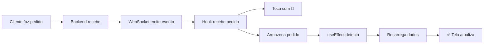

# 🔧 Correção: Atualização Automática de Pedidos via WebSocket

**Data:** 29/10/2025  
**Branch:** `bugfix/analise-erros-logica`  
**Problema:** Painel operacional não atualiza automaticamente quando cliente faz pedido

---

## 🐛 Problema

Quando o **cliente faz um pedido**, a tela do **garçom/operacional** (cozinha, bar, etc.) **não atualiza automaticamente**. Era necessário apertar **F5** para ver os novos pedidos.

### Comportamento Anterior

```
Cliente faz pedido → Backend recebe → WebSocket emite evento
                                            ↓
                                     Garçom ouve som 🔔
                                            ↓
                                     ❌ Tela NÃO atualiza
                                            ↓
                                     Precisa apertar F5
```

---

## ✅ Solução Implementada

### 1. **Modificação no Hook `useAmbienteNotification`**

O hook agora **retorna o pedido completo** recebido via WebSocket:

```typescript:frontend/src/hooks/useAmbienteNotification.ts
interface UseAmbienteNotificationReturn {
  novoPedidoId: string | null;
  audioConsentNeeded: boolean;
  handleAllowAudio: () => void;
  clearNotification: () => void;
  isConnected: boolean;
  novoPedidoRecebido: Pedido | null; // ✅ NOVO: Pedido completo recebido
}

export const useAmbienteNotification = (ambienteId: string | null) => {
  const [novoPedidoRecebido, setNovoPedidoRecebido] = useState<Pedido | null>(null);

  // Quando recebe novo pedido via WebSocket
  socketRef.current.on(novoPedidoEvent, (pedido: Pedido) => {
    // Toca o som
    playNotificationSound();
    
    // Define o ID para destacar
    setNovoPedidoId(pedido.id);
    
    // ✅ NOVO: Armazena o pedido completo
    setNovoPedidoRecebido(pedido);
    
    // Limpa após 5 segundos
    setTimeout(() => {
      setNovoPedidoId(null);
      setNovoPedidoRecebido(null);
    }, 5000);
  });

  return {
    // ... outros retornos
    novoPedidoRecebido, // ✅ Retorna o pedido
  };
};
```

### 2. **Modificação na Página Operacional**

A página agora **recarrega os dados** quando recebe um novo pedido:

```typescript:frontend/src/app/(protected)/dashboard/operacional/[ambienteId]/OperacionalClientPage.tsx
export function OperacionalClientPage({ ambienteId }: { ambienteId: string }) {
  // Hook de notificação
  const { 
    novoPedidoId, 
    audioConsentNeeded, 
    handleAllowAudio,
    isConnected,
    novoPedidoRecebido // ✅ NOVO: Recebe o pedido
  } = useAmbienteNotification(ambienteId);

  // ✅ NOVO: Recarrega dados quando recebe novo pedido
  useEffect(() => {
    if (novoPedidoRecebido) {
      console.log('🆕 Novo pedido recebido, recarregando dados...');
      fetchDados();
    }
  }, [novoPedidoRecebido]);

  // ... resto do código
}
```

---

## 🔄 Fluxo Corrigido



---

## 📊 Comparação

### Antes (Com Problema)

| Ação | Comportamento |
|------|---------------|
| Cliente faz pedido | ✅ Backend recebe |
| WebSocket emite | ✅ Garçom ouve som |
| Tela atualiza | ❌ Não atualiza |
| Solução | ❌ Apertar F5 manualmente |

### Depois (Corrigido)

| Ação | Comportamento |
|------|---------------|
| Cliente faz pedido | ✅ Backend recebe |
| WebSocket emite | ✅ Garçom ouve som |
| Tela atualiza | ✅ Atualiza automaticamente |
| Solução | ✅ Sem intervenção necessária |

---

## 🎯 Benefícios

1. **✅ Tempo Real:** Pedidos aparecem instantaneamente
2. **✅ Sem F5:** Não precisa recarregar manualmente
3. **✅ Eficiência:** Garçom/cozinha vê pedidos imediatamente
4. **✅ Melhor UX:** Fluxo mais fluido e profissional

---

## 🧪 Como Testar

### Teste 1: Novo Pedido na Cozinha
```bash
1. Abrir painel operacional da cozinha
2. Em outra aba, fazer pedido como cliente
3. ✅ Deve ouvir som de notificação
4. ✅ Pedido deve aparecer automaticamente na coluna "A Fazer"
5. ✅ Pedido deve ter destaque verde por 5 segundos
```

### Teste 2: Novo Pedido no Bar
```bash
1. Abrir painel operacional do bar
2. Cliente faz pedido de bebida
3. ✅ Som toca
4. ✅ Pedido aparece automaticamente
5. ✅ Sem necessidade de F5
```

### Teste 3: Múltiplos Pedidos
```bash
1. Abrir painel operacional
2. Fazer 3 pedidos seguidos como cliente
3. ✅ Todos devem aparecer automaticamente
4. ✅ Som toca para cada um
5. ✅ Cada um tem destaque por 5 segundos
```

### Teste 4: WebSocket Desconectado
```bash
1. Desconectar internet
2. Fazer pedido
3. ✅ Polling de fallback (30s) deve funcionar
4. ✅ Pedido aparece em até 30 segundos
```

---

## 📝 Arquivos Modificados

### 1. Hook de Notificação
**Arquivo:** `frontend/src/hooks/useAmbienteNotification.ts`

**Mudanças:**
- Adicionado estado `novoPedidoRecebido`
- Armazena pedido completo ao receber evento
- Retorna `novoPedidoRecebido` na interface

### 2. Página Operacional
**Arquivo:** `frontend/src/app/(protected)/dashboard/operacional/[ambienteId]/OperacionalClientPage.tsx`

**Mudanças:**
- Recebe `novoPedidoRecebido` do hook
- Adicionado `useEffect` para recarregar dados
- Chama `fetchDados()` quando recebe novo pedido

---

## 🔧 Detalhes Técnicos

### WebSocket Event
```typescript
// Backend emite
socket.emit(`novo_pedido_ambiente:${ambienteId}`, pedido);

// Frontend escuta
socket.on(`novo_pedido_ambiente:${ambienteId}`, (pedido: Pedido) => {
  // Processa pedido
});
```

### Timeout de Limpeza
```typescript
setTimeout(() => {
  setNovoPedidoId(null);
  setNovoPedidoRecebido(null);
}, 5000); // 5 segundos
```

### Fallback de Polling
```typescript
// Se WebSocket desconectar, usa polling
if (!isConnected) {
  const intervalId = setInterval(fetchDados, 30000); // 30 segundos
  return () => clearInterval(intervalId);
}
```

---

## 🔮 Melhorias Futuras (Opcional)

1. **Animação de Entrada:** Pedido novo "desliza" para dentro
2. **Contador de Novos:** Badge mostrando quantos pedidos novos
3. **Filtro de Tempo:** Mostrar apenas pedidos das últimas X horas
4. **Notificação Desktop:** Usar Notification API do navegador
5. **Vibração Mobile:** Vibrar dispositivo ao receber pedido

---

## 🐛 Possíveis Problemas

### Problema 1: Pedido Duplicado
**Causa:** WebSocket emite evento e polling também busca  
**Solução:** Polling só ativa se WebSocket desconectado

### Problema 2: Som Não Toca
**Causa:** Navegador bloqueia áudio sem interação do usuário  
**Solução:** Botão "Ativar Som" já implementado

### Problema 3: Muitas Requisições
**Causa:** Múltiplos pedidos em sequência  
**Solução:** Debounce pode ser adicionado se necessário

---

## 📚 Documentação Relacionada

- `CORRECAO_LOGICA_AGREGADOS.md` - Lógica de agregados
- `CORRECAO_BOTOES_MESA.md` - Botões após confirmar mesa
- `ADICAO_CAMPO_OBSERVACAO.md` - Campo de observação
- `ADICAO_LOCAL_ENTREGA_PEDIDOS.md` - Local de entrega

---

## 🔗 Integração

Esta correção se integra com:
- ✅ WebSocket Gateway (backend)
- ✅ Hook `useAmbienteNotification`
- ✅ Página Operacional
- ✅ Sistema de notificações sonoras
- ✅ Polling de fallback

---

**Status:** ✅ Correção Implementada  
**Impacto:** 🔥 Crítico - Sistema agora funciona em tempo real  
**Complexidade:** ⭐⭐ Média - Modificação de hook + página
