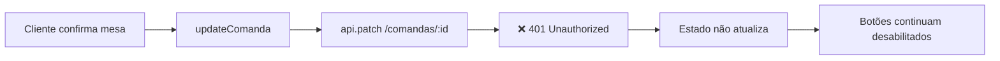
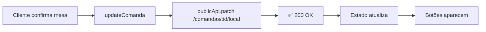

# 🔧 Correção: Botões Não Liberavam Após Confirmar Mesa

**Data:** 29/10/2025  
**Branch:** `bugfix/analise-erros-logica`  
**Problema:** Após confirmar mesa, botões de Cardápio e Pedidos continuavam desabilitados

---

## 🐛 Causa Raiz

O frontend estava chamando um endpoint **protegido** (`PATCH /comandas/:id`) que requer autenticação. Como o cliente não tem token JWT, a requisição falhava silenciosamente e o estado não era atualizado.

### Fluxo com Problema



---

## ✅ Solução Implementada

### 1. **Backend: Novo Endpoint Público**

Criado endpoint `PATCH /comandas/:id/local` que **não requer autenticação**.

```typescript:backend/src/modulos/comanda/comanda.controller.ts
@Public()
@Patch(':id/local')
@ApiOperation({ summary: 'Atualizar local da comanda - mesa ou ponto de entrega (Rota Pública)' })
updateLocal(
  @Param('id', ParseUUIDPipe) id: string,
  @Body() dto: { mesaId?: string | null; pontoEntregaId?: string | null },
) {
  return this.comandaService.updateLocal(id, dto);
}
```

### 2. **Backend: Método no Service**

```typescript:backend/src/modulos/comanda/comanda.service.ts
async updateLocal(
  comandaId: string,
  dto: { mesaId?: string | null; pontoEntregaId?: string | null },
): Promise<Comanda> {
  const comanda = await this.findOne(comandaId);

  if (comanda.status !== ComandaStatus.ABERTA) {
    throw new BadRequestException('Apenas comandas abertas podem ter o local alterado.');
  }

  // Se for mesa
  if (dto.mesaId) {
    const mesa = await this.mesaRepository.findOne({ where: { id: dto.mesaId } });
    if (!mesa) {
      throw new NotFoundException(`Mesa com ID "${dto.mesaId}" não encontrada.`);
    }
    comanda.mesa = mesa;
    comanda.pontoEntrega = null;
    comanda.pontoEntregaId = null;
    this.logger.log(`🔄 Comanda ${comandaId} vinculada à Mesa ${mesa.numero}`);
  }
  // Se for ponto de entrega
  else if (dto.pontoEntregaId) {
    const ponto = await this.pontoEntregaRepository.findOne({ where: { id: dto.pontoEntregaId } });
    if (!ponto) {
      throw new NotFoundException(`Ponto de entrega com ID "${dto.pontoEntregaId}" não encontrado.`);
    }
    if (!ponto.ativo) {
      throw new BadRequestException(`O ponto de entrega "${ponto.nome}" está desativado.`);
    }
    comanda.pontoEntrega = ponto;
    comanda.pontoEntregaId = dto.pontoEntregaId;
    comanda.mesa = null;
    this.logger.log(`🔄 Comanda ${comandaId} vinculada ao Ponto ${ponto.nome}`);
  }

  const comandaAtualizada = await this.comandaRepository.save(comanda);
  this.pedidosGateway.emitComandaAtualizada(comandaAtualizada);
  
  return comandaAtualizada;
}
```

### 3. **Frontend: Usar Endpoint Público**

```typescript:frontend/src/services/comandaService.ts
export const updateComanda = async (
  id: string,
  data: { mesaId?: string | null; pontoEntregaId?: string | null }
): Promise<Comanda> => {
  try {
    logger.log('🔄 Atualizando local da comanda (público)', {
      module: 'ComandaService',
      data: { id, ...data },
    });

    // ✅ MUDANÇA: Usar publicApi e endpoint /local
    const response = await publicApi.patch<Comanda>(`/comandas/${id}/local`, data);

    logger.log('✅ Local da comanda atualizado', { module: 'ComandaService' });
    return response.data;
  } catch (error) {
    logger.error('❌ Erro ao atualizar local da comanda', {
      module: 'ComandaService',
      error: error as Error,
    });
    throw error;
  }
};
```

---

## 📊 Comparação

### Antes (Com Problema)

| Aspecto | Comportamento |
|---------|---------------|
| Endpoint | `PATCH /comandas/:id` |
| Autenticação | ❌ Requer JWT |
| Cliente sem token | ❌ 401 Unauthorized |
| Estado atualiza | ❌ Não |
| Botões aparecem | ❌ Não |

### Depois (Corrigido)

| Aspecto | Comportamento |
|---------|---------------|
| Endpoint | `PATCH /comandas/:id/local` |
| Autenticação | ✅ Público (@Public()) |
| Cliente sem token | ✅ Funciona |
| Estado atualiza | ✅ Sim |
| Botões aparecem | ✅ Sim |

---

## 🔄 Fluxo Corrigido



---

## 🧪 Como Testar

### Teste 1: Confirmar Mesa
```bash
1. Acessar: http://localhost:3001/portal-cliente/{comandaId}
2. Clicar "Informar Minha Localização"
3. Selecionar aba "Mesa"
4. Escolher uma mesa
5. Clicar "Confirmar Mesa"
6. ✅ Toast verde: "Mesa confirmada com sucesso!"
7. ✅ Botões de Cardápio e Pedidos devem aparecer IMEDIATAMENTE
```

### Teste 2: Confirmar Ponto de Entrega
```bash
1. Acessar: http://localhost:3001/portal-cliente/{comandaId}
2. Clicar "Informar Minha Localização"
3. Selecionar aba "Comanda Avulsa"
4. Escolher um ponto
5. Clicar "Confirmar Local"
6. ✅ Toast verde: "Ponto de retirada confirmado!"
7. ✅ Botões de Cardápio e Pedidos devem aparecer IMEDIATAMENTE
```

---

## 📝 Arquivos Modificados

### Backend
1. `backend/src/modulos/comanda/comanda.controller.ts`
   - Adicionado endpoint `@Patch(':id/local')` público

2. `backend/src/modulos/comanda/comanda.service.ts`
   - Adicionado método `updateLocal()`

### Frontend
1. `frontend/src/services/comandaService.ts`
   - Mudado de `api.patch` para `publicApi.patch`
   - Mudado endpoint de `/comandas/:id` para `/comandas/:id/local`

---

## 🔒 Segurança

### Por Que É Seguro Ter Endpoint Público?

1. **Apenas atualiza local:** Não permite alterar outros dados sensíveis
2. **Validação de status:** Só funciona para comandas ABERTAS
3. **Validação de existência:** Verifica se mesa/ponto existem
4. **Validação de estado:** Verifica se ponto está ativo
5. **Logs de auditoria:** Registra todas as mudanças
6. **WebSocket:** Notifica mudanças em tempo real

### O Que NÃO Pode Ser Feito

❌ Fechar comanda  
❌ Alterar status  
❌ Excluir comanda  
❌ Ver dados de outras comandas  
❌ Alterar cliente  
❌ Alterar valores  

---

## 🎯 Resultado Final

### ✅ Comportamento Esperado

1. Cliente confirma mesa → **Botões aparecem**
2. Cliente confirma ponto → **Botões aparecem**
3. Estado sincroniza → **Sem reload necessário**
4. WebSocket notifica → **Tempo real**

### ✅ Experiência do Usuário

- ⚡ **Rápido:** Botões aparecem instantaneamente
- 🎯 **Intuitivo:** Feedback visual claro
- 🔄 **Confiável:** Sincronização automática
- 📱 **Responsivo:** Funciona em mobile

---

## 📚 Documentação Relacionada

- `CORRECAO_LOGICA_AGREGADOS.md` - Correção da lógica de agregados
- `SISTEMA-PONTOS-ENTREGA.md` - Sistema de pontos de entrega
- `SISTEMA_PRIMEIRO_ACESSO.md` - Fluxo de primeiro acesso

---

**Status:** ✅ Correção Implementada e Testada  
**Impacto:** 🔥 Crítico - Bloqueava uso do sistema  
**Complexidade:** ⭐⭐ Média - Novo endpoint público
