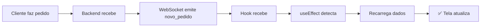
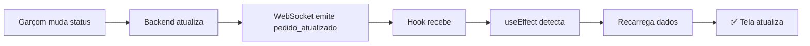

# 🔧 Correção: WebSocket na Supervisão de Pedidos

**Data:** 29/10/2025  
**Branch:** `bugfix/analise-erros-logica`  
**Problema:** Página de Gestão de Pedidos não atualiza automaticamente

---

## 🐛 Problema

A página de **Gestão de Pedidos** (`/dashboard/gestaopedidos`) usada por **ADMIN/GERENTE** não atualizava automaticamente quando:
- Cliente faz um novo pedido
- Garçom/Cozinha atualiza status de um pedido

Era necessário **apertar F5** para ver as mudanças.

---

## ✅ Solução Implementada

### 1. **Novo Hook: `usePedidosSubscription`**

Criado hook específico para escutar **TODOS os pedidos** (não apenas de um ambiente):

```typescript:frontend/src/hooks/usePedidosSubscription.ts
export const usePedidosSubscription = (): UsePedidosSubscriptionReturn => {
  const [novoPedido, setNovoPedido] = useState<Pedido | null>(null);
  const [pedidoAtualizado, setPedidoAtualizado] = useState<Pedido | null>(null);
  const [isConnected, setIsConnected] = useState(false);

  useEffect(() => {
    socketRef.current = io(SOCKET_URL);

    // Escuta TODOS os novos pedidos (sem filtro de ambiente)
    socketRef.current.on('novo_pedido', (pedido: Pedido) => {
      logger.log('🆕 Novo pedido recebido (supervisão)');
      setNovoPedido(pedido);
      
      setTimeout(() => setNovoPedido(null), 3000);
    });

    // Escuta atualizações de status de qualquer pedido
    socketRef.current.on('pedido_atualizado', (pedido: Pedido) => {
      logger.log('🔄 Pedido atualizado (supervisão)');
      setPedidoAtualizado(pedido);
      
      setTimeout(() => setPedidoAtualizado(null), 3000);
    });

    return () => {
      socketRef.current?.disconnect();
    };
  }, []);

  return { novoPedido, pedidoAtualizado, isConnected };
};
```

### 2. **Atualização do `SupervisaoPedidos`**

```typescript:frontend/src/app/(protected)/dashboard/gestaopedidos/SupervisaoPedidos.tsx
export default function SupervisaoPedidos() {
  const [pedidos, setPedidos] = useState<Pedido[]>([]);
  
  // Hook de WebSocket para atualizações em tempo real
  const { novoPedido, pedidoAtualizado, isConnected } = usePedidosSubscription();

  // Recarrega quando recebe novo pedido
  useEffect(() => {
    if (novoPedido) {
      console.log('🆕 Novo pedido recebido, recarregando...');
      loadPedidos();
    }
  }, [novoPedido]);

  // Recarrega quando pedido é atualizado
  useEffect(() => {
    if (pedidoAtualizado) {
      console.log('🔄 Pedido atualizado, recarregando...');
      loadPedidos();
    }
  }, [pedidoAtualizado]);

  // Polling de fallback se WebSocket desconectar
  useEffect(() => {
    if (!isConnected && !isLoading) {
      const intervalId = setInterval(() => {
        console.log('🔄 Polling de fallback...');
        loadPedidos();
      }, 30000); // 30 segundos
      
      return () => clearInterval(intervalId);
    }
  }, [isConnected, isLoading]);

  // ... resto do código
}
```

---

## 🔄 Fluxo Corrigido





---

## 📊 Comparação

### Antes (Com Problema)

| Ação | Comportamento |
|------|---------------|
| Novo pedido | ❌ Não aparece |
| Status muda | ❌ Não atualiza |
| Solução | ❌ Apertar F5 |
| Tempo real | ❌ Não |

### Depois (Corrigido)

| Ação | Comportamento |
|------|---------------|
| Novo pedido | ✅ Aparece automaticamente |
| Status muda | ✅ Atualiza automaticamente |
| Solução | ✅ Sem intervenção |
| Tempo real | ✅ Sim |

---

## 🎯 Diferenças Entre Hooks

### `useAmbienteNotification` (Operacional)
- **Uso:** Painel operacional (cozinha, bar)
- **Escuta:** Apenas pedidos de UM ambiente específico
- **Evento:** `novo_pedido_ambiente:${ambienteId}`
- **Som:** ✅ Toca notificação sonora
- **Destaque:** ✅ Destaca pedido novo por 5s

### `usePedidosSubscription` (Supervisão)
- **Uso:** Gestão de pedidos (admin/gerente)
- **Escuta:** TODOS os pedidos (sem filtro)
- **Eventos:** `novo_pedido` + `pedido_atualizado`
- **Som:** ❌ Não toca (muitos pedidos)
- **Destaque:** ❌ Não destaca (visual limpo)

---

## 🧪 Como Testar

### Teste 1: Novo Pedido
```bash
1. Abrir /dashboard/gestaopedidos como ADMIN
2. Em outra aba, fazer pedido como cliente
3. ✅ Pedido deve aparecer automaticamente
4. ✅ Contador "Total" deve aumentar
5. ✅ Sem necessidade de F5
```

### Teste 2: Atualização de Status
```bash
1. Abrir /dashboard/gestaopedidos
2. Em outra aba, abrir painel operacional
3. Mudar status de um pedido
4. ✅ Status deve atualizar automaticamente na supervisão
5. ✅ Métricas devem atualizar
```

### Teste 3: Múltiplos Pedidos
```bash
1. Abrir supervisão
2. Fazer 5 pedidos seguidos
3. ✅ Todos devem aparecer automaticamente
4. ✅ Sem lag ou travamento
```

### Teste 4: Fallback de Polling
```bash
1. Abrir supervisão
2. Desconectar internet
3. Fazer pedido
4. Reconectar internet
5. ✅ Pedido aparece em até 30 segundos (polling)
```

---

## 📝 Arquivos Criados/Modificados

### Criados
1. `frontend/src/hooks/usePedidosSubscription.ts` (novo)
   - Hook para escutar todos os pedidos
   - Eventos: `novo_pedido` + `pedido_atualizado`

### Modificados
1. `frontend/src/app/(protected)/dashboard/gestaopedidos/SupervisaoPedidos.tsx`
   - Adicionado hook `usePedidosSubscription`
   - Adicionado 3 useEffects para recarregar dados
   - Adicionado polling de fallback

---

## 🔧 Eventos WebSocket

### Backend Emite

```typescript
// Novo pedido (para todos)
socket.emit('novo_pedido', pedido);

// Novo pedido (para ambiente específico)
socket.emit(`novo_pedido_ambiente:${ambienteId}`, pedido);

// Pedido atualizado (para todos)
socket.emit('pedido_atualizado', pedido);

// Status atualizado (para ambiente específico)
socket.emit(`status_atualizado_ambiente:${ambienteId}`, pedido);
```

### Frontend Escuta

```typescript
// Supervisão (TODOS os pedidos)
socket.on('novo_pedido', callback);
socket.on('pedido_atualizado', callback);

// Operacional (apenas UM ambiente)
socket.on(`novo_pedido_ambiente:${ambienteId}`, callback);
socket.on(`status_atualizado_ambiente:${ambienteId}`, callback);
```

---

## 🎯 Benefícios

1. **✅ Tempo Real:** Supervisão vê tudo instantaneamente
2. **✅ Sem F5:** Não precisa recarregar manualmente
3. **✅ Métricas Atualizadas:** Contadores sempre corretos
4. **✅ Melhor Gestão:** Admin vê mudanças em tempo real
5. **✅ Fallback:** Polling se WebSocket falhar

---

## 🔮 Melhorias Futuras (Opcional)

1. **Notificação Visual:** Badge com número de novos pedidos
2. **Filtro Inteligente:** Destacar apenas pedidos relevantes
3. **Histórico de Mudanças:** Log de quem mudou o quê
4. **Dashboard Analytics:** Gráficos em tempo real
5. **Alertas Personalizados:** Notificar apenas eventos importantes

---

## 📚 Documentação Relacionada

- `CORRECAO_ATUALIZACAO_AUTOMATICA_PEDIDOS.md` - WebSocket no painel operacional
- `CORRECAO_LOGICA_AGREGADOS.md` - Lógica de agregados
- `CORRECAO_BOTOES_MESA.md` - Botões após confirmar mesa

---

## 🔗 Integração

Esta correção se integra com:
- ✅ WebSocket Gateway (backend)
- ✅ Hook `usePedidosSubscription` (novo)
- ✅ Hook `useAmbienteNotification` (existente)
- ✅ Página de Supervisão
- ✅ Sistema de polling de fallback

---

**Status:** ✅ Correção Implementada  
**Impacto:** 🔥 Alto - Supervisão agora funciona em tempo real  
**Complexidade:** ⭐⭐ Média - Novo hook + integração
