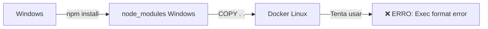
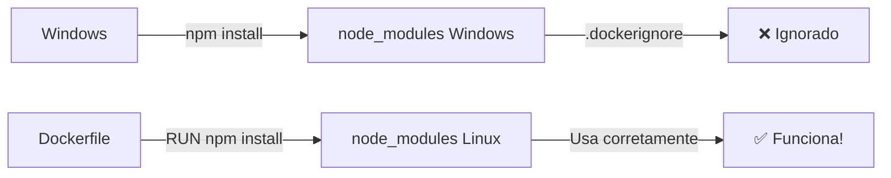

# 🐳 Docker Automatizado - Guia Completo

## 🎯 Problema Resolvido

Quando você instala dependências nativas (como `bcrypt`) no **Windows** e tenta rodar no **Docker (Linux)**, ocorre o erro:

```
Error loading shared library bcrypt_lib.node: Exec format error
```

**Causa:** Módulos nativos são compilados para a arquitetura do sistema operacional onde foram instalados.

---

## ✅ Solução Implementada

### 1. **Arquivos `.dockerignore` Criados**

Agora o Docker **sempre ignora** o `node_modules` do Windows e instala as dependências dentro do container Linux.

**Arquivos criados:**
- `backend/.dockerignore`
- `frontend/.dockerignore`

**O que eles fazem:**
```
node_modules     ← Ignora node_modules do Windows
dist             ← Ignora builds locais
.env.local       ← Ignora variáveis de ambiente locais
```

### 2. **Scripts PowerShell Criados**

#### 📜 `docker-start.ps1` - Uso Diário

```powershell
.\docker-start.ps1
```

**O que faz:**
1. ✅ Verifica se `.dockerignore` existe (cria se não existir)
2. 🚀 Inicia os containers
3. 📊 Mostra o status
4. 📝 Exibe URLs de acesso

**Quando usar:**
- Todo dia ao começar a trabalhar
- Após fazer `git pull`
- Sempre que quiser subir o projeto

---

#### 🔨 `docker-rebuild.ps1` - Reconstrução Completa

```powershell
.\docker-rebuild.ps1
```

**O que faz:**
1. ⏹️ Para todos os containers
2. 🗑️ Remove `node_modules` locais (Windows)
3. 🔨 Reconstrói as imagens Docker do zero
4. 🚀 Inicia os containers
5. 📊 Mostra o status

**Quando usar:**
- ⚠️ Após instalar dependências nativas (bcrypt, sharp, canvas, etc.)
- ⚠️ Quando mudar versão do Node.js
- ⚠️ Quando tiver erros de módulos compilados
- ⚠️ Após atualizar o Dockerfile

---

## 🚀 Como Usar

### Cenário 1: Trabalho Diário Normal

```powershell
# Abrir o projeto
cd d:\projetos\pub-system

# Subir os containers
.\docker-start.ps1

# Trabalhar normalmente...

# Ao final do dia
docker-compose down
```

### Cenário 2: Instalou Nova Dependência

```powershell
# Exemplo: instalou bcrypt ou sharp
npm install bcrypt --save

# IMPORTANTE: Reconstruir o Docker
.\docker-rebuild.ps1
```

### Cenário 3: Erro de Módulo Nativo

```
Error: Exec format error
Error loading shared library
```

**Solução:**
```powershell
.\docker-rebuild.ps1
```

---

## 📋 Comandos Úteis

### Ver Logs em Tempo Real
```powershell
# Todos os serviços
docker-compose logs -f

# Apenas backend
docker-compose logs -f backend

# Apenas frontend
docker-compose logs -f frontend
```

### Parar Containers
```powershell
docker-compose down
```

### Reiniciar Um Serviço Específico
```powershell
docker-compose restart backend
```

### Entrar no Container
```powershell
# Backend
docker-compose exec backend sh

# Frontend
docker-compose exec frontend sh
```

### Limpar Tudo (Cuidado!)
```powershell
# Remove containers, volumes e imagens
docker-compose down -v --rmi all
```

---

## 🔍 Entendendo o Fluxo

### Fluxo Antigo (Com Problema)



### Fluxo Novo (Correto)



---

## 📁 Estrutura dos Arquivos

### `backend/.dockerignore`
```
node_modules       # ← Ignora node_modules do Windows
dist
build
.env.local
*.log
```

### `backend/Dockerfile`
```dockerfile
FROM node:20-alpine
WORKDIR /usr/src/app

# Copia apenas package.json
COPY package*.json ./

# Instala dependências DENTRO do Linux
RUN npm install --force

# Copia o resto (sem node_modules por causa do .dockerignore)
COPY . .

CMD ["npm", "run", "start:dev"]
```

---

## ⚠️ Avisos Importantes

### ❌ NÃO Faça Isso:
```powershell
# NÃO instale dependências localmente e suba direto
npm install bcrypt
docker-compose up -d  # ← VAI DAR ERRO!
```

### ✅ Faça Isso:
```powershell
# Instale localmente (para o editor reconhecer)
npm install bcrypt

# Reconstrua o Docker
.\docker-rebuild.ps1  # ← Instala no Linux
```

---

## 🎓 Conceitos Importantes

### Por Que Módulos Nativos São Problemáticos?

Módulos como `bcrypt`, `sharp`, `canvas` são escritos em **C/C++** e compilados para o sistema operacional específico:

- **Windows:** `.dll` (Dynamic Link Library)
- **Linux:** `.so` (Shared Object)
- **macOS:** `.dylib` (Dynamic Library)

Quando você instala no Windows e tenta rodar no Docker (Linux), os binários são incompatíveis.

### O Que é `.dockerignore`?

É como o `.gitignore`, mas para o Docker. Ele diz ao Docker quais arquivos **não copiar** para dentro do container.

### Por Que `--no-cache` no Rebuild?

```powershell
docker-compose build --no-cache
```

O `--no-cache` força o Docker a:
1. Ignorar cache de builds anteriores
2. Baixar tudo novamente
3. Recompilar todos os módulos

Isso garante que não haja resquícios de builds antigos com problemas.

---

## 🆘 Troubleshooting

### Problema: Script não executa

**Erro:**
```
.\docker-start.ps1 : File cannot be loaded because running scripts is disabled
```

**Solução:**
```powershell
# Executar como administrador
Set-ExecutionPolicy RemoteSigned -Scope CurrentUser
```

### Problema: Docker não inicia

**Erro:**
```
Cannot connect to the Docker daemon
```

**Solução:**
1. Abrir Docker Desktop
2. Aguardar inicializar completamente
3. Tentar novamente

### Problema: Porta já em uso

**Erro:**
```
Error: Port 3000 is already in use
```

**Solução:**
```powershell
# Parar todos os containers
docker-compose down

# Ver o que está usando a porta
netstat -ano | findstr :3000

# Matar o processo (substitua PID)
taskkill /PID <numero> /F
```

---

## 📚 Referências

- [Docker Best Practices](https://docs.docker.com/develop/dev-best-practices/)
- [.dockerignore Documentation](https://docs.docker.com/engine/reference/builder/#dockerignore-file)
- [Node.js Docker Best Practices](https://github.com/nodejs/docker-node/blob/main/docs/BestPractices.md)

---

## ✅ Checklist de Uso

### Primeiro Uso
- [ ] Clonar repositório
- [ ] Executar `.\docker-rebuild.ps1`
- [ ] Acessar http://localhost:3001
- [ ] Fazer login com `admin@admin.com` / `admin123`

### Uso Diário
- [ ] Executar `.\docker-start.ps1`
- [ ] Desenvolver normalmente
- [ ] Ao final: `docker-compose down`

### Após Instalar Dependências
- [ ] Instalar no Windows: `npm install <pacote>`
- [ ] Reconstruir Docker: `.\docker-rebuild.ps1`
- [ ] Testar se funciona

### Antes de Fazer Commit
- [ ] Verificar se `.dockerignore` está no Git
- [ ] Verificar se `node_modules` NÃO está no Git
- [ ] Testar com `.\docker-rebuild.ps1`

---

**🎉 Pronto! Agora você tem um ambiente Docker totalmente automatizado e sem dores de cabeça com módulos nativos!**
