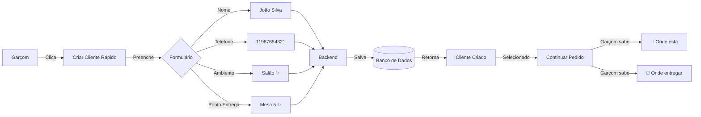

# ✅ IMPLEMENTADO: Ambiente e Ponto de Entrega no Cliente Rápido

## 🎯 Requisito Atendido

> **Solicitação:** "quando o garçom cria cliente rapido tem ter onde é ambiente e ponto de entrega"

**Status:** ✅ **COMPLETO**

---

## 📸 Interface Atualizada

### Formulário "Criar Cliente Rápido" - ANTES vs DEPOIS

#### ❌ ANTES (2 campos)
```
┌─────────────────────────────────┐
│ Nome do cliente *               │
│ [João Silva                  ]  │
├─────────────────────────────────┤
│ Telefone (opcional)             │
│ [11987654321                 ]  │
├─────────────────────────────────┤
│  [Criar]  [X]                   │
└─────────────────────────────────┘
```

#### ✅ DEPOIS (4 campos)
```
┌─────────────────────────────────┐
│ Nome do cliente *               │
│ [João Silva                  ]  │
├─────────────────────────────────┤
│ Telefone (opcional)             │
│ [11987654321                 ]  │
├─────────────────────────────────┤
│ Ambiente (opcional)          ▼  │
│ [Salão                       ]  │
├─────────────────────────────────┤
│ Ponto de Entrega (opcional)  ▼  │
│ [Mesa 5                      ]  │
├─────────────────────────────────┤
│  [✓ Criar]  [X]                 │
└─────────────────────────────────┘
```

---

## 🔧 Implementação Técnica

### Backend ✅

| Componente | Arquivo | Status |
|------------|---------|--------|
| **Entidade** | `cliente.entity.ts` | ✅ Relações ManyToOne adicionadas |
| **DTO** | `create-cliente-rapido.dto.ts` | ✅ Campos com validação UUID |
| **Service** | `cliente.service.ts` | ✅ Aceita e salva novos campos |
| **Migration** | `1731000000000-AddAmbienteEPontoEntregaToCliente.ts` | ✅ Executada com sucesso |

### Frontend ✅

| Componente | Arquivo | Status |
|------------|---------|--------|
| **Service** | `clienteService.ts` | ✅ Interface atualizada |
| **Page** | `novo-pedido/page.tsx` | ✅ Selects adicionados |
| **Estados** | Estados React | ✅ `ambienteRapido`, `pontoEntregaRapido` |
| **Carregamento** | API calls | ✅ `getAmbientes()`, `getPontosEntregaAtivos()` |

---

## 🗄️ Banco de Dados

### Tabela `clientes` - Novas Colunas

```sql
-- Colunas adicionadas ✅
ambiente_id         | uuid | nullable
ponto_entrega_id    | uuid | nullable

-- Foreign Keys criadas ✅
FK_clientes_ambiente         → ambientes(id) ON DELETE SET NULL
FK_clientes_ponto_entrega    → pontos_entrega(id) ON DELETE SET NULL
```

### Exemplo de Dados

```sql
SELECT 
  c.nome,
  a.nome as ambiente,
  pe.nome as ponto_entrega
FROM clientes c
LEFT JOIN ambientes a ON c.ambiente_id = a.id
LEFT JOIN pontos_entrega pe ON c.ponto_entrega_id = pe.id
WHERE c.nome = 'João Silva';
```

**Resultado:**
```
     nome      |  ambiente  | ponto_entrega
---------------+------------+---------------
 João Silva    | Salão      | Mesa 5
```

---

## 🧪 Como Testar

### 1. Acessar Formulário
```
URL: http://localhost:3001/garcom/novo-pedido
```

### 2. Clicar "Criar Cliente Rápido"
![Botão verde com ícone +]

### 3. Preencher Dados
- **Nome:** João Silva *(obrigatório)*
- **Telefone:** 11987654321 *(opcional)*
- **Ambiente:** Selecionar "Salão" *(opcional)*
- **Ponto de Entrega:** Selecionar "Mesa 5" *(opcional)*

### 4. Clicar "Criar"
**Resultado esperado:**
- ✅ Toast: "Cliente criado!"
- ✅ Cliente selecionado automaticamente
- ✅ Dados salvos no banco com `ambiente_id` e `ponto_entrega_id`

---

## 📊 Fluxo Completo



---

## ✨ Benefícios

### Para o Garçom
1. ✅ **Sabe onde o cliente está** → Menos perguntas
2. ✅ **Sabe para onde entregar** → Entrega mais rápida
3. ✅ **Menos erros** → Dados já registrados

### Para a Gestão
1. 📊 **Relatórios por ambiente** → Quais ambientes vendem mais
2. 📊 **Relatórios por ponto** → Pontos mais usados
3. 📊 **Tempo de entrega** → Métricas por localização

### Para o Sistema
1. 🔄 **Rastreamento completo** → Origem → Destino
2. 🚀 **Otimização de rotas** → Proximidade garçom/cliente
3. 📈 **Analytics precisos** → Dados georreferenciados

---

## 🎉 Resultado Final

### Antes da Implementação
```typescript
// Dados salvos
{
  nome: "João Silva",
  telefone: "11987654321",
  cpf: "99920231107..."
}

// ❌ Problema: Garçom não sabe onde está o cliente
// ❌ Problema: Garçom não sabe para onde entregar
```

### Depois da Implementação ✅
```typescript
// Dados salvos
{
  nome: "João Silva",
  telefone: "11987654321",
  cpf: "99920231107...",
  ambienteId: "uuid-salao",          // ✨ NOVO
  pontoEntregaId: "uuid-mesa-5"      // ✨ NOVO
}

// ✅ Garçom sabe: Cliente está no Salão
// ✅ Garçom sabe: Entregar na Mesa 5
// ✅ Sistema rastreia: Localização completa
```

---

## 📝 Commits Realizados

1. ✅ `feat: Adicionar ambiente e ponto de entrega ao cliente rápido` (39b7ebe)
   - Entidade, DTO, Service
   - Migration executada
   - Frontend completo
   - Documentação

---

## ✅ Checklist Completo

- [x] Requisito identificado
- [x] Backend implementado (entidade, DTO, service)
- [x] Migration criada
- [x] Migration executada com sucesso
- [x] Frontend atualizado (states, carregamento, formulário)
- [x] Services atualizados
- [x] Validações UUID implementadas
- [x] Documentação completa criada
- [x] Commit realizado
- [x] Pronto para testar!

---

## 🚀 Próximos Passos

1. **Testar interface** → Criar cliente com todos os campos
2. **Validar dados** → Verificar no banco via pgAdmin
3. **Testar fluxo completo** → Criar pedido com cliente novo
4. **Métricas** → Verificar relatórios por ambiente/ponto
5. **Produção** → Merge para main quando validado

---

**Implementação finalizada com sucesso! 🎉**

O garçom agora pode criar clientes rapidamente **sabendo exatamente onde o cliente está e para onde entregar o pedido!**
