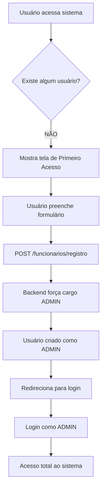
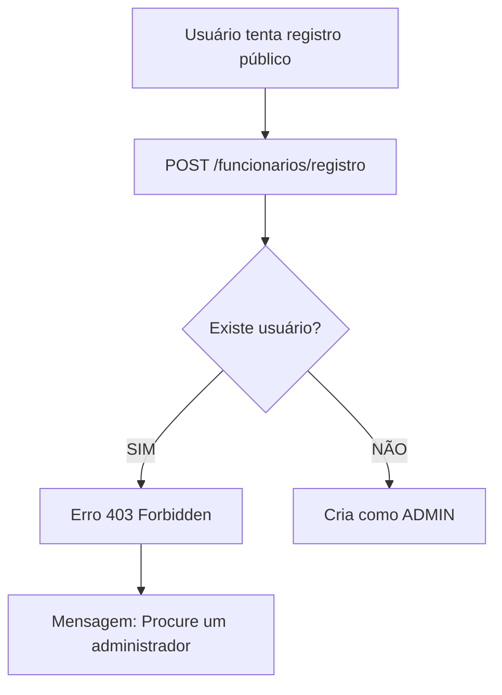

# 🎯 Sistema de Primeiro Acesso - Pub System

**Data:** 23 de outubro de 2025  
**Implementado por:** Cascade AI

---

## 📋 Visão Geral

O sistema implementa um **mecanismo de primeiro acesso** onde o primeiro usuário a se registrar automaticamente se torna **ADMINISTRADOR**. Após isso, apenas administradores podem criar novos funcionários.

---

## 🔐 Como Funciona

### 1️⃣ Primeiro Usuário (Registro Público)

**Endpoint:** `POST /funcionarios/registro` (Público - sem autenticação)

**Comportamento:**
- ✅ Se **não houver nenhum usuário** no banco:
  - Cria o usuário com cargo **ADMIN** (força automaticamente)
  - Ignora o cargo enviado no body
  - Retorna sucesso (201)
  
- ❌ Se **já existir algum usuário**:
  - Bloqueia o registro
  - Retorna erro 403 (Forbidden)
  - Mensagem: "Já existe um usuário no sistema. Novos funcionários devem ser criados por um administrador."

**Exemplo de Uso:**
```bash
# Primeiro acesso - Vira ADMIN automaticamente
curl -X POST http://localhost:3000/funcionarios/registro \
  -H "Content-Type: application/json" \
  -d '{
    "nome": "João Silva",
    "email": "joao@empresa.com",
    "senha": "senha123",
    "cargo": "GARCOM"  # <- IGNORADO! Será forçado para ADMIN
  }'

# Resposta:
{
  "id": "uuid...",
  "nome": "João Silva",
  "email": "joao@empresa.com",
  "cargo": "ADMIN"  # <- Forçado automaticamente
}
```

---

### 2️⃣ Usuários Subsequentes (Apenas ADMIN)

**Endpoint:** `POST /funcionarios` (Protegido - requer token ADMIN)

**Comportamento:**
- ✅ Apenas usuários com cargo **ADMIN** podem criar novos funcionários
- ✅ Respeita o cargo enviado no body
- ✅ Pode criar: ADMIN, CAIXA, GARCOM, COZINHA

**Exemplo de Uso:**
```bash
# Login como ADMIN
curl -X POST http://localhost:3000/auth/login \
  -H "Content-Type: application/json" \
  -d '{
    "email": "joao@empresa.com",
    "senha": "senha123"
  }'

# Criar novo funcionário (com token)
curl -X POST http://localhost:3000/funcionarios \
  -H "Content-Type: application/json" \
  -H "Authorization: Bearer SEU_TOKEN_AQUI" \
  -d '{
    "nome": "Maria Santos",
    "email": "maria@empresa.com",
    "senha": "senha456",
    "cargo": "GARCOM"  # <- Será respeitado
  }'
```

---

## 🎬 Fluxo de Implementação

### Cenário 1: Sistema Novo (Sem Usuários)



### Cenário 2: Sistema com Usuários



---

## 🛠️ Implementação Técnica

### Backend

**Arquivo:** `backend/src/modulos/funcionario/funcionario.service.ts`

```typescript
async registroPrimeiroAcesso(createFuncionarioDto: CreateFuncionarioDto): Promise<Funcionario> {
  // Verifica se já existe algum usuário
  const contador = await this.funcionarioRepository.count();
  
  if (contador > 0) {
    throw new ForbiddenException(
      'Já existe um usuário no sistema. Novos funcionários devem ser criados por um administrador.'
    );
  }

  // Primeiro usuário - força cargo ADMIN
  const senhaHash = await bcrypt.hash(createFuncionarioDto.senha, 10);
  const primeiroUsuario = this.funcionarioRepository.create({
    ...createFuncionarioDto,
    senha: senhaHash,
    cargo: Cargo.ADMIN, // Força ADMIN independente do que foi enviado
  });

  return await this.funcionarioRepository.save(primeiroUsuario);
}
```

**Arquivo:** `backend/src/modulos/funcionario/funcionario.controller.ts`

```typescript
// Endpoint PÚBLICO (sem guards)
@Post('registro')
@ApiOperation({ 
  summary: 'Registro público de primeiro acesso',
  description: 'O primeiro usuário a se registrar automaticamente vira ADMIN.'
})
async registro(@Body() createFuncionarioDto: CreateFuncionarioDto) {
  return this.funcionarioService.registroPrimeiroAcesso(createFuncionarioDto);
}

// Endpoint PROTEGIDO (com guards)
@Post()
@ApiBearerAuth()
@UseGuards(JwtAuthGuard, RolesGuard)
@Roles(Cargo.ADMIN)
create(@Body() createFuncionarioDto: CreateFuncionarioDto) {
  return this.funcionarioService.create(createFuncionarioDto);
}
```

---

## 🎨 Frontend (A Implementar)

### Página de Primeiro Acesso

**Arquivo:** `frontend/src/app/(public)/primeiro-acesso/page.tsx`

```typescript
'use client';

import { useState, useEffect } from 'react';
import { useRouter } from 'next/navigation';
import { Button } from '@/components/ui/button';
import { Input } from '@/components/ui/input';
import { toast } from 'sonner';

export default function PrimeiroAcessoPage() {
  const router = useRouter();
  const [loading, setLoading] = useState(false);
  const [formData, setFormData] = useState({
    nome: '',
    email: '',
    senha: '',
    confirmarSenha: ''
  });

  const handleSubmit = async (e: React.FormEvent) => {
    e.preventDefault();
    
    if (formData.senha !== formData.confirmarSenha) {
      toast.error('As senhas não coincidem');
      return;
    }

    setLoading(true);
    try {
      const response = await fetch('http://localhost:3000/funcionarios/registro', {
        method: 'POST',
        headers: { 'Content-Type': 'application/json' },
        body: JSON.stringify({
          nome: formData.nome,
          email: formData.email,
          senha: formData.senha,
          cargo: 'ADMIN' // Será forçado no backend de qualquer forma
        })
      });

      if (!response.ok) {
        const error = await response.json();
        throw new Error(error.message);
      }

      toast.success('Conta de administrador criada com sucesso!');
      router.push('/login');
    } catch (error: any) {
      toast.error(error.message || 'Erro ao criar conta');
    } finally {
      setLoading(false);
    }
  };

  return (
    <div className="min-h-screen flex items-center justify-center bg-gradient-to-br from-blue-50 to-indigo-100">
      <div className="max-w-md w-full bg-white rounded-lg shadow-xl p-8">
        <div className="text-center mb-8">
          <h1 className="text-3xl font-bold text-gray-900">🎉 Bem-vindo!</h1>
          <p className="text-gray-600 mt-2">
            Este é o primeiro acesso ao sistema.
          </p>
          <p className="text-sm text-indigo-600 font-medium mt-1">
            Você será o administrador principal.
          </p>
        </div>

        <form onSubmit={handleSubmit} className="space-y-4">
          <div>
            <label className="block text-sm font-medium text-gray-700 mb-1">
              Nome Completo
            </label>
            <Input
              type="text"
              required
              value={formData.nome}
              onChange={(e) => setFormData({...formData, nome: e.target.value})}
              placeholder="João Silva"
            />
          </div>

          <div>
            <label className="block text-sm font-medium text-gray-700 mb-1">
              E-mail
            </label>
            <Input
              type="email"
              required
              value={formData.email}
              onChange={(e) => setFormData({...formData, email: e.target.value})}
              placeholder="joao@empresa.com"
            />
          </div>

          <div>
            <label className="block text-sm font-medium text-gray-700 mb-1">
              Senha
            </label>
            <Input
              type="password"
              required
              minLength={6}
              value={formData.senha}
              onChange={(e) => setFormData({...formData, senha: e.target.value})}
              placeholder="Mínimo 6 caracteres"
            />
          </div>

          <div>
            <label className="block text-sm font-medium text-gray-700 mb-1">
              Confirmar Senha
            </label>
            <Input
              type="password"
              required
              value={formData.confirmarSenha}
              onChange={(e) => setFormData({...formData, confirmarSenha: e.target.value})}
              placeholder="Digite a senha novamente"
            />
          </div>

          <Button 
            type="submit" 
            className="w-full" 
            disabled={loading}
          >
            {loading ? 'Criando...' : 'Criar Conta de Administrador'}
          </Button>
        </form>

        <div className="mt-6 p-4 bg-blue-50 rounded-lg">
          <p className="text-xs text-gray-600">
            <strong>ℹ️ Importante:</strong> Após criar sua conta, você terá acesso total ao sistema 
            e poderá criar contas para outros funcionários (garçons, cozinheiros, caixa, etc).
          </p>
        </div>
      </div>
    </div>
  );
}
```

### Lógica de Redirecionamento

**Arquivo:** `frontend/src/app/page.tsx`

```typescript
'use client';

import { useEffect } from 'react';
import { useRouter } from 'next/navigation';

export default function HomePage() {
  const router = useRouter();

  useEffect(() => {
    async function checkFirstAccess() {
      try {
        // Verifica se existe algum usuário
        const response = await fetch('http://localhost:3000/funcionarios/check-first-access');
        const { isFirstAccess } = await response.json();

        if (isFirstAccess) {
          router.push('/primeiro-acesso');
        } else {
          router.push('/login');
        }
      } catch (error) {
        // Em caso de erro, vai para login
        router.push('/login');
      }
    }

    checkFirstAccess();
  }, [router]);

  return (
    <div className="min-h-screen flex items-center justify-center">
      <p>Carregando...</p>
    </div>
  );
}
```

---

## 🧪 Testando o Sistema

### 1. Testar Primeiro Acesso (Swagger)

1. Acesse: `http://localhost:3000/api`
2. Encontre o endpoint: `POST /funcionarios/registro`
3. Clique em "Try it out"
4. Preencha o body:
```json
{
  "nome": "Admin Teste",
  "email": "admin@teste.com",
  "senha": "senha123",
  "cargo": "GARCOM"
}
```
5. Execute
6. **Resultado esperado:** Usuário criado com `cargo: "ADMIN"`

### 2. Testar Bloqueio de Segundo Registro

1. Tente executar o mesmo endpoint novamente
2. **Resultado esperado:** Erro 403 com mensagem de bloqueio

### 3. Testar Criação por ADMIN

1. Faça login com o admin criado
2. Use o token no endpoint `POST /funcionarios`
3. Crie um funcionário com cargo diferente
4. **Resultado esperado:** Cargo respeitado

---

## ✅ Checklist de Implementação

### Backend
- [x] Método `registroPrimeiroAcesso()` no service
- [x] Endpoint público `POST /funcionarios/registro`
- [x] Validação de primeiro acesso
- [x] Força cargo ADMIN
- [x] Logs implementados
- [x] Swagger documentado

### Frontend (A Fazer)
- [ ] Página de primeiro acesso
- [ ] Verificação de primeiro acesso na home
- [ ] Redirecionamento automático
- [ ] Validação de formulário
- [ ] Feedback visual
- [ ] Testes

---

## 🔒 Segurança

### Proteções Implementadas

1. ✅ **Bloqueio após primeiro usuário** - Impede registros públicos subsequentes
2. ✅ **Força cargo ADMIN** - Não confia no input do usuário
3. ✅ **Hash de senha** - Bcrypt com 10 rounds
4. ✅ **Validação de email único** - Constraint no banco
5. ✅ **Logs de auditoria** - Registra todas tentativas

### Considerações

- O endpoint `/funcionarios/registro` é **público** mas **auto-bloqueante**
- Após o primeiro usuário, **apenas ADMIN** pode criar novos
- O cargo enviado no primeiro registro é **ignorado** (sempre ADMIN)
- Não há como "resetar" sem limpar o banco de dados

---

## 📝 Notas Importantes

1. **Desenvolvimento:** O `onModuleInit` cria um admin padrão se o banco estiver vazio
2. **Produção:** Use o endpoint `/funcionarios/registro` para criar o primeiro admin
3. **Backup:** Sempre tenha um admin ativo antes de remover outros
4. **Auditoria:** Todos os registros são logados

---

## 🎯 Próximos Passos

1. Implementar frontend da página de primeiro acesso
2. Adicionar verificação automática na home
3. Criar testes automatizados
4. Documentar no README principal
5. Adicionar ao guia de instalação

---

**Implementado em:** 23 de outubro de 2025  
**Status:** ✅ Backend Completo | ⏳ Frontend Pendente  
**Testado:** ✅ Swagger | ⏳ E2E
