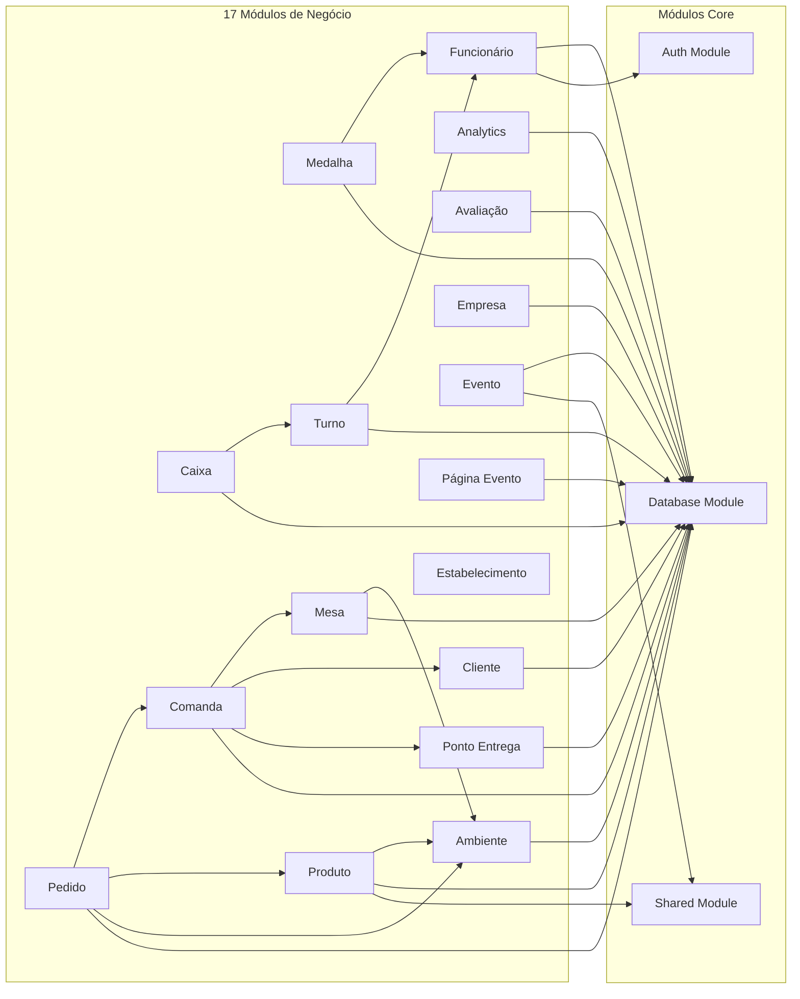
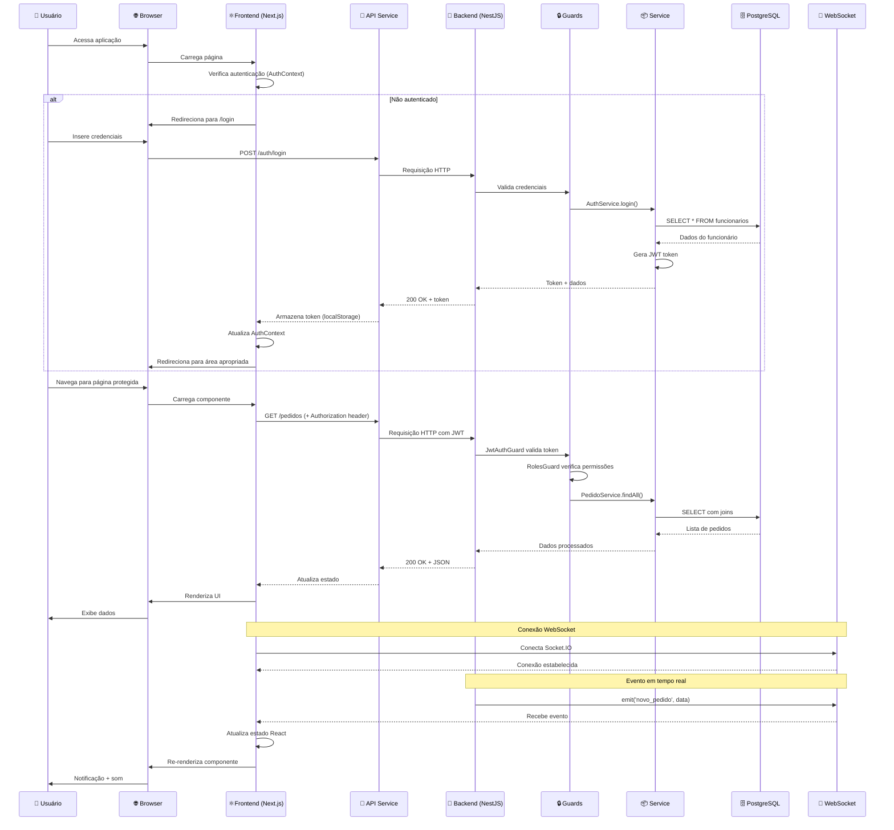
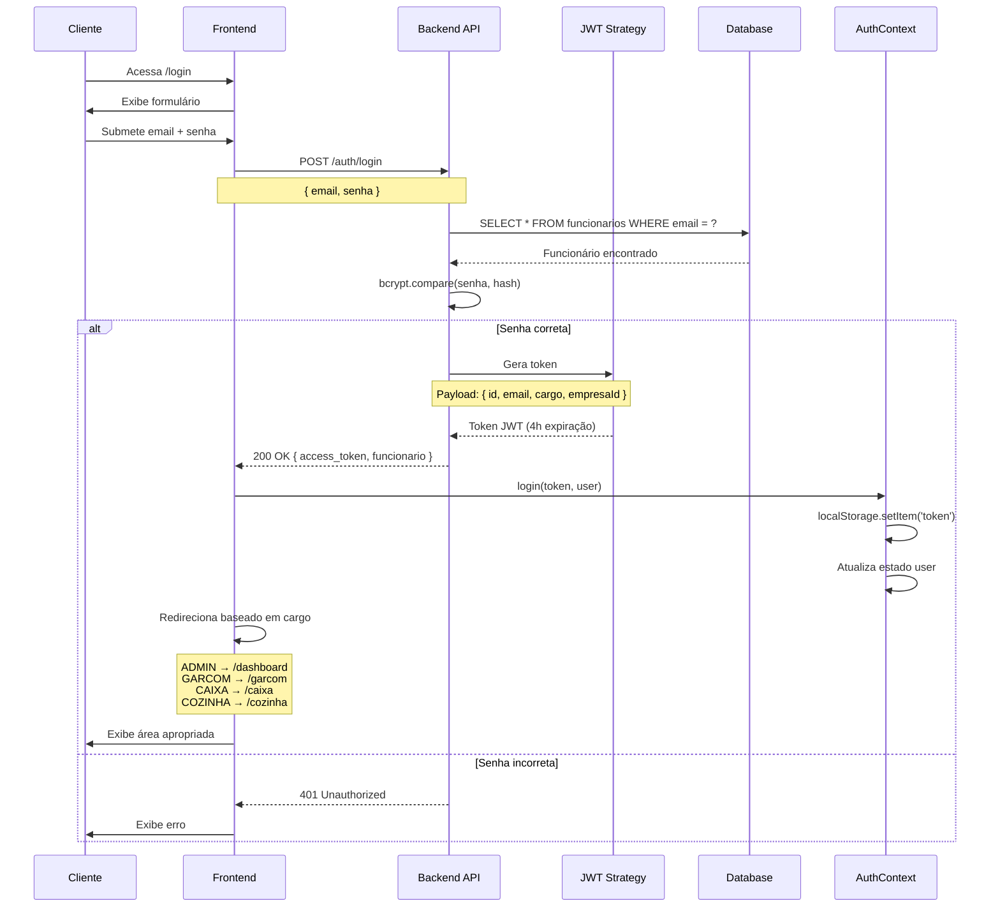
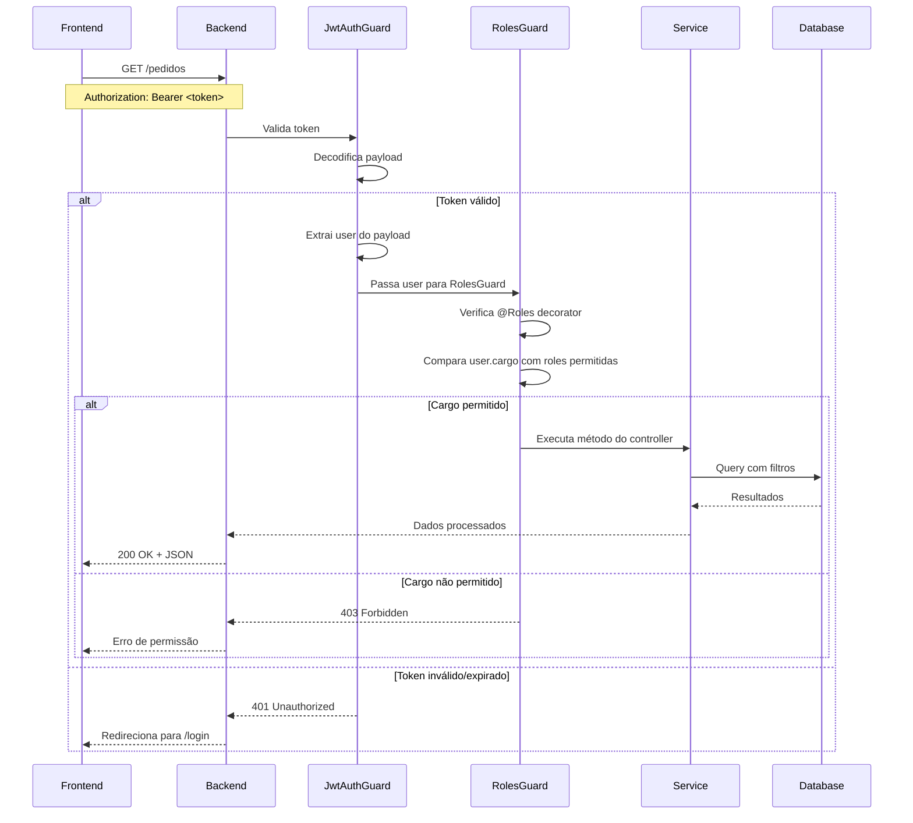
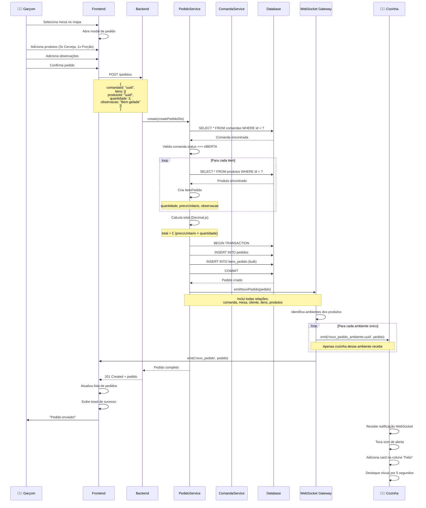
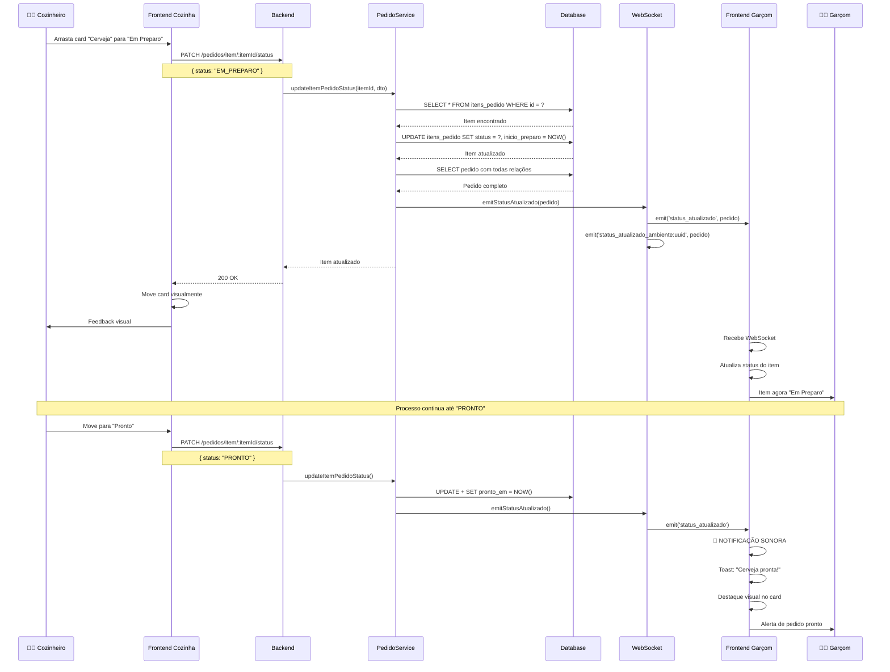
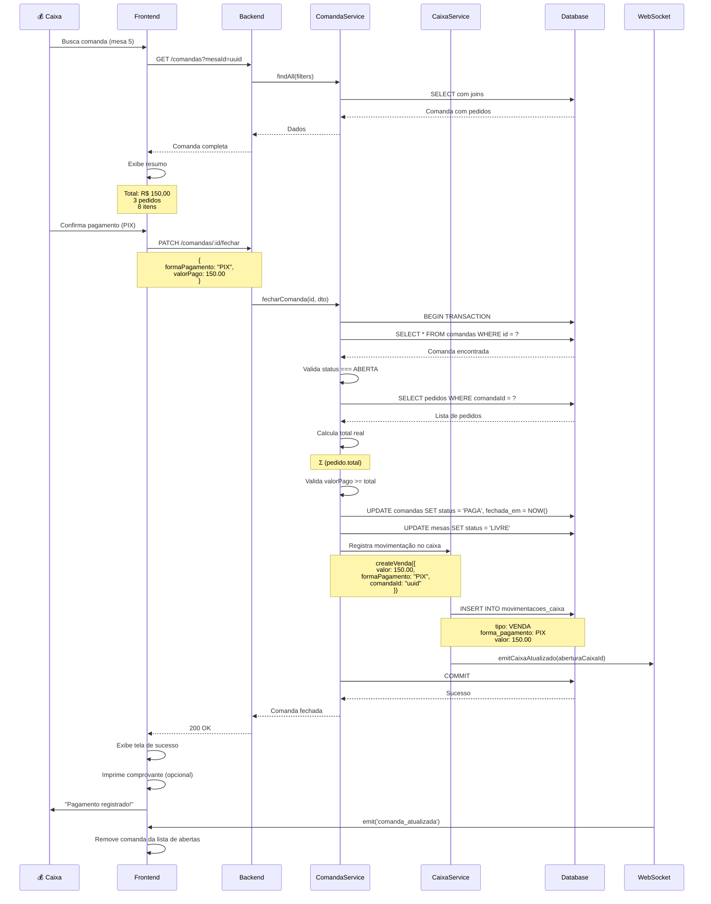
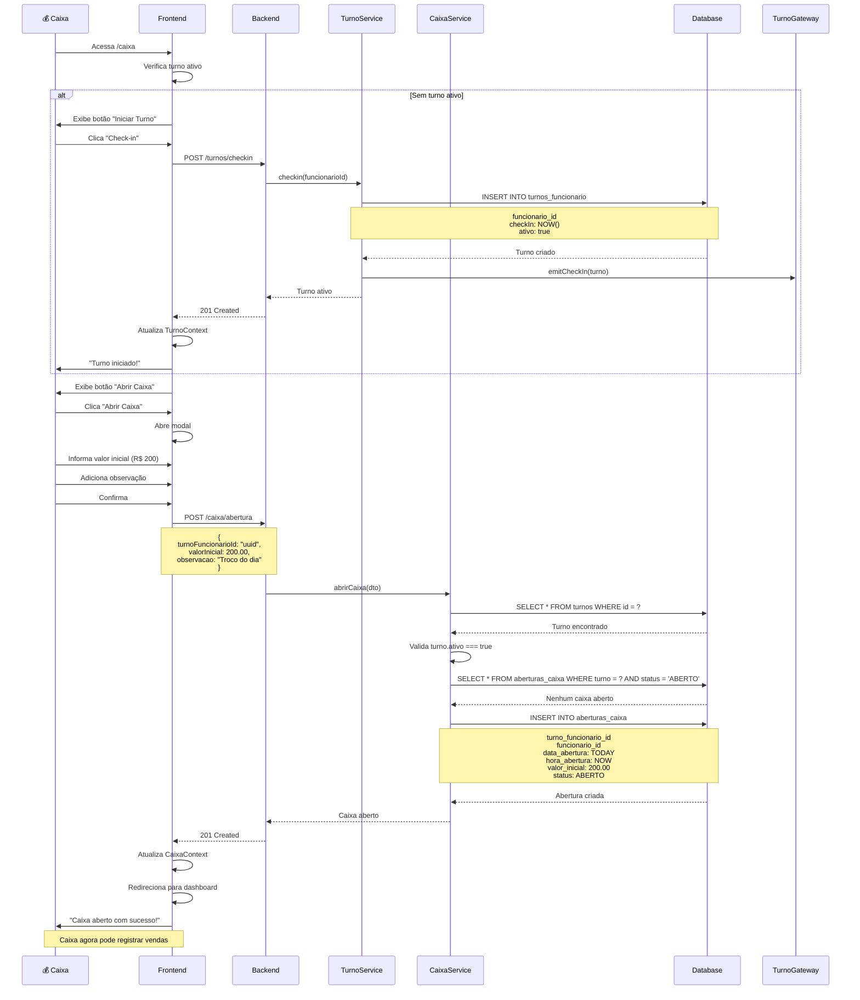

# 🏗️ Documentação de Arquitetura Técnica - Pub System

**Data:** 17 de Dezembro de 2025  
**Versão:** 1.0  
**Analista:** Cascade AI

---

## 📋 Sumário

1. [Diagrama de Componentes](#1-diagrama-de-componentes)
2. [Fluxo de Dados](#2-fluxo-de-dados)
3. [Sequência de Operações Críticas](#3-sequência-de-operações-críticas)
4. [Estrutura de Diretórios Comentada](#4-estrutura-de-diretórios-comentada)

---

## 1. 📊 Diagrama de Componentes

### 1.1 Visão Geral do Sistema

```mermaid
graph TB
    subgraph "CLIENTE"
        Browser[🌐 Navegador Web]
        Mobile[📱 Mobile Browser]
    end

    subgraph "FRONTEND - Next.js 15"
        AppRouter[App Router]
        
        subgraph "Rotas Públicas"
            Cliente[Cliente - QR Code]
            Evento[Eventos]
            Entrada[Entrada]
        end
        
        subgraph "Rotas Protegidas"
            Dashboard[Dashboard Admin]
            Garcom[Área Garçom]
            Caixa[Área Caixa]
            Cozinha[Área Cozinha]
        end
        
        subgraph "Contextos"
            AuthCtx[AuthContext]
            TurnoCtx[TurnoContext]
            CaixaCtx[CaixaContext]
            SocketCtx[SocketContext]
        end
        
        subgraph "Services"
            API[API Services]
            WS[WebSocket Client]
        end
    end

    subgraph "BACKEND - NestJS 10"
        subgraph "Auth"
            JWT[JWT Strategy]
            Guards[Guards & Roles]
        end
        
        subgraph "Controllers"
            AuthC[Auth Controller]
            PedidoC[Pedido Controller]
            ComandaC[Comanda Controller]
            CaixaC[Caixa Controller]
            ProdutoC[Produto Controller]
            MesaC[Mesa Controller]
            FuncC[Funcionário Controller]
        end
        
        subgraph "Services"
            PedidoS[Pedido Service]
            ComandaS[Comanda Service]
            CaixaS[Caixa Service]
            ProdutoS[Produto Service]
            MesaS[Mesa Service]
            FuncS[Funcionário Service]
        end
        
        subgraph "Gateways"
            PedidoGW[Pedidos Gateway]
            TurnoGW[Turno Gateway]
        end
        
        subgraph "Shared"
            Storage[GCS Storage]
            Logger[Logger]
            Filters[Exception Filters]
        end
    end

    subgraph "DATABASE"
        PostgreSQL[(PostgreSQL 15)]
        
        subgraph "Entidades"
            Empresa[Empresa]
            Funcionario[Funcionário]
            Mesa[Mesa]
            Comanda[Comanda]
            Pedido[Pedido]
            ItemPedido[Item Pedido]
            Produto[Produto]
            Caixa[Caixa]
        end
    end

    subgraph "EXTERNAL"
        GCS[Google Cloud Storage]
        SMTP[Email Service]
    end

    Browser --> AppRouter
    Mobile --> AppRouter
    
    AppRouter --> Cliente
    AppRouter --> Dashboard
    AppRouter --> Garcom
    AppRouter --> Caixa
    AppRouter --> Cozinha
    
    Cliente --> API
    Dashboard --> API
    Garcom --> API
    Caixa --> API
    Cozinha --> API
    
    API --> AuthC
    API --> PedidoC
    API --> ComandaC
    API --> CaixaC
    
    WS <--> PedidoGW
    WS <--> TurnoGW
    
    AuthC --> JWT
    PedidoC --> Guards
    ComandaC --> Guards
    
    PedidoC --> PedidoS
    ComandaC --> ComandaS
    CaixaC --> CaixaS
    
    PedidoS --> PostgreSQL
    ComandaS --> PostgreSQL
    CaixaS --> PostgreSQL
    ProdutoS --> PostgreSQL
    
    ProdutoS --> Storage
    Storage --> GCS
    
    PedidoS --> PedidoGW
    
    PostgreSQL --> Empresa
    PostgreSQL --> Funcionario
    PostgreSQL --> Mesa
    PostgreSQL --> Comanda
    PostgreSQL --> Pedido
    PostgreSQL --> ItemPedido
    PostgreSQL --> Produto
    PostgreSQL --> Caixa
```



### 1.2 Arquitetura de Módulos Backend



---

## 2. 🔄 Fluxo de Dados

### 2.1 Fluxo Completo: Usuário → Frontend → Backend → DB



### 2.2 Fluxo de Autenticação Detalhado



### 2.3 Fluxo de Requisição Protegida



---

## 3. ⚡ Sequência de Operações Críticas

### 3.1 Criar Pedido (Operação Completa)



### 3.2 Atualizar Status de Item (Cozinha → Garçom)



### 3.3 Fechar Comanda e Registrar Pagamento



### 3.4 Abertura de Caixa (Início do Turno)



---

## 4. 📁 Estrutura de Diretórios Comentada

### 4.1 Backend (NestJS)

```
backend/
├── src/
│   ├── main.ts                          # 🚀 Entry point - Bootstrap da aplicação
│   │                                    # - Configura ValidationPipe global
│   │                                    # - Ativa Helmet, CORS, Rate Limiting
│   │                                    # - Registra Exception Filter e Logging Interceptor
│   │                                    # - Inicializa Swagger (apenas dev)
│   │                                    # - Executa seeder
│   │
│   ├── app.module.ts                    # 📦 Módulo raiz
│   │                                    # - Importa ConfigModule (validação Joi)
│   │                                    # - Configura TypeORM (PostgreSQL)
│   │                                    # - Importa 17 módulos de negócio
│   │                                    # - Configura ThrottlerModule (rate limiting)
│   │                                    # - Configura ScheduleModule (cron jobs)
│   │
│   ├── auth/                            # 🔐 Autenticação e Autorização
│   │   ├── auth.module.ts              # - Configura JwtModule (4h expiração)
│   │   ├── auth.service.ts             # - Login, validação de credenciais
│   │   ├── auth.controller.ts          # - POST /auth/login, GET /auth/profile
│   │   ├── strategies/
│   │   │   └── jwt.strategy.ts         # - Valida JWT, extrai payload
│   │   ├── guards/
│   │   │   ├── jwt-auth.guard.ts       # - Verifica se usuário está autenticado
│   │   │   └── roles.guard.ts          # - Verifica se cargo tem permissão
│   │   └── decorators/
│   │       ├── roles.decorator.ts      # - @Roles(Cargo.ADMIN, Cargo.GERENTE)
│   │       └── current-user.decorator.ts # - @CurrentUser() user: Funcionario
│   │
│   ├── common/                          # 🛠️ Utilitários Compartilhados
│   │   ├── filters/
│   │   │   └── http-exception.filter.ts # - Captura todas exceções
│   │   │                                # - Log diferenciado (erro/warn)
│   │   │                                # - Resposta padronizada JSON
│   │   └── interceptors/
│   │       └── logging.interceptor.ts   # - Log de entrada/saída
│   │                                    # - Calcula tempo de resposta
│   │                                    # - Log de erros
│   │
│   ├── database/                        # 🗄️ Configuração de Banco
│   │   ├── data-source.ts              # - TypeORM DataSource
│   │   │                                # - Configuração para migrations
│   │   ├── migrations/                  # - 16 arquivos de migration
│   │   │   ├── 1700000000000-InitialSchema.ts
│   │   │   ├── 1731431000000-CreateCaixaTables.ts
│   │   │   └── ...                      # - Versionamento do schema
│   │   ├── seeder.module.ts            # - Módulo de seed
│   │   └── seeder.service.ts           # - Popula dados iniciais
│   │                                    # - Empresa, Admin, Ambientes, Produtos
│   │
│   ├── shared/                          # 🔗 Módulos Compartilhados
│   │   └── storage/
│   │       ├── storage.module.ts       # - Módulo de storage
│   │       └── gcs-storage.service.ts  # - Upload para Google Cloud Storage
│   │                                    # - uploadFile(file, folderPath)
│   │                                    # - deleteFile(publicUrl)
│   │
│   └── modulos/                         # 📦 17 Módulos de Negócio
│       │
│       ├── ambiente/                    # 🏢 Ambientes (PREPARO/ATENDIMENTO)
│       │   ├── ambiente.module.ts      # - TypeORM: Ambiente, Produto, Mesa
│       │   ├── ambiente.controller.ts  # - CRUD de ambientes
│       │   ├── ambiente.service.ts     # - Lógica de negócio
│       │   ├── entities/
│       │   │   └── ambiente.entity.ts  # - @Entity('ambientes')
│       │   │                            # - id, nome, tipo, produtos[], mesas[]
│       │   └── dto/
│       │       ├── create-ambiente.dto.ts
│       │       └── update-ambiente.dto.ts
│       │
│       ├── analytics/                   # 📊 Relatórios e Métricas
│       │   ├── analytics.module.ts
│       │   ├── analytics.controller.ts # - GET /analytics/geral
│       │   │                            # - GET /analytics/garcons
│       │   │                            # - GET /analytics/ambientes
│       │   └── analytics.service.ts    # - Queries complexas com agregações
│       │                                # - Cálculo de métricas
│       │
│       ├── avaliacao/                   # ⭐ Sistema de Avaliações
│       │   ├── avaliacao.module.ts
│       │   ├── avaliacao.controller.ts # - POST /avaliacoes (criar)
│       │   │                            # - GET /avaliacoes (listar)
│       │   ├── avaliacao.service.ts    # - Estatísticas de satisfação
│       │   └── entities/
│       │       └── avaliacao.entity.ts # - nota (1-5), comentario, comandaId
│       │
│       ├── caixa/                       # 💰 Gestão Financeira (13 arquivos)
│       │   ├── caixa.module.ts         # - TypeORM: 4 entidades
│       │   │                            # - Importa PedidoModule (WebSocket)
│       │   ├── caixa.controller.ts     # - POST /caixa/abertura
│       │   │                            # - POST /caixa/fechamento
│       │   │                            # - POST /caixa/sangria
│       │   │                            # - POST /caixa/suprimento
│       │   │                            # - GET /caixa/resumo/:id
│       │   ├── caixa.service.ts        # - Lógica financeira complexa
│       │   │                            # - Cálculo de diferenças
│       │   │                            # - Validações de negócio
│       │   ├── entities/
│       │   │   ├── abertura-caixa.entity.ts    # - Abertura do caixa
│       │   │   ├── fechamento-caixa.entity.ts  # - Fechamento com totais
│       │   │   ├── sangria.entity.ts           # - Retiradas de dinheiro
│       │   │   └── movimentacao-caixa.entity.ts # - Vendas registradas
│       │   └── dto/                     # - 8 DTOs específicos
│       │
│       ├── cliente/                     # 👥 Gestão de Clientes
│       │   ├── cliente.module.ts
│       │   ├── cliente.controller.ts   # - CRUD de clientes
│       │   │                            # - GET /clientes/buscar/:termo
│       │   ├── cliente.service.ts      # - Busca por CPF, nome, telefone
│       │   └── entities/
│       │       └── cliente.entity.ts   # - cpf (unique), nome, email, celular
│       │
│       ├── comanda/                     # 📋 Sistema de Comandas (13 arquivos)
│       │   ├── comanda.module.ts       # - TypeORM: Comanda, Pedido, Mesa, Cliente
│       │   │                            # - Importa PedidoModule (WebSocket)
│       │   ├── comanda.controller.ts   # - POST /comandas (criar)
│       │   │                            # - GET /comandas/:id/public (QR Code)
│       │   │                            # - PATCH /comandas/:id/fechar
│       │   │                            # - POST /comandas/recuperar (público)
│       │   ├── comanda.service.ts      # - Lógica de abertura/fechamento
│       │   │                            # - Validações de status
│       │   │                            # - Cálculo de totais
│       │   ├── entities/
│       │   │   ├── comanda.entity.ts   # - status (ABERTA/FECHADA/PAGA)
│       │   │   │                        # - mesaId OU pontoEntregaId
│       │   │   │                        # - pedidos[], cliente
│       │   │   └── comanda-agregado.entity.ts # - Múltiplos clientes
│       │   └── dto/                     # - 6 DTOs
│       │
│       ├── empresa/                     # 🏢 Dados do Estabelecimento
│       │   ├── empresa.module.ts
│       │   ├── empresa.controller.ts   # - GET /empresa
│       │   │                            # - PATCH /empresa/:id
│       │   ├── empresa.service.ts
│       │   └── entities/
│       │       └── empresa.entity.ts   # - cnpj, nome, telefone, endereço
│       │
│       ├── estabelecimento/             # 🏗️ Layout (Entity apenas)
│       │   └── entities/
│       │       └── estabelecimento.entity.ts # - Configuração de layout
│       │                                # - Sem controller (não usado ainda)
│       │
│       ├── evento/                      # 🎉 Eventos Especiais
│       │   ├── evento.module.ts        # - Importa StorageModule
│       │   ├── evento.controller.ts    # - CRUD de eventos
│       │   │                            # - PATCH /eventos/:id/upload (imagem)
│       │   ├── evento.service.ts       # - Upload de imagens para GCS
│       │   │                            # - Pasta: eventos/
│       │   └── entities/
│       │       └── evento.entity.ts    # - titulo, descricao, dataEvento
│       │                                # - urlImagem, valor, ativo
│       │
│       ├── funcionario/                 # 👨‍💼 Gestão de Funcionários (11 arquivos)
│       │   ├── funcionario.module.ts
│       │   ├── funcionario.controller.ts # - CRUD (apenas ADMIN)
│       │   │                            # - PATCH /funcionarios/:id/senha
│       │   ├── funcionario.service.ts  # - Hash de senhas (bcrypt)
│       │   │                            # - Validações de email único
│       │   └── entities/
│       │       └── funcionario.entity.ts # - nome, email, senha (hash)
│       │                                # - cargo (enum: 5 roles)
│       │                                # - empresaId, ambienteId
│       │
│       ├── medalha/                     # 🏆 Sistema de Gamificação
│       │   ├── medalha.module.ts
│       │   ├── medalha.controller.ts   # - GET /medalhas/garcom/:id
│       │   │                            # - GET /medalhas/garcom/:id/progresso
│       │   ├── medalha.service.ts      # - Cálculo de conquistas
│       │   │                            # - Verificação de critérios
│       │   └── entities/
│       │       └── medalha.entity.ts   # - nome, descricao, criterio
│       │                                # - icone, funcionarioId
│       │
│       ├── mesa/                        # 🪑 Gestão de Mesas
│       │   ├── mesa.module.ts
│       │   ├── mesa.controller.ts      # - CRUD de mesas
│       │   │                            # - GET /mesas/publico (sem auth)
│       │   │                            # - PATCH /mesas/:id/status
│       │   ├── mesa.service.ts
│       │   └── entities/
│       │       └── mesa.entity.ts      # - numero, capacidade
│       │                                # - status (LIVRE/OCUPADA/RESERVADA)
│       │                                # - ambienteId, posicaoX, posicaoY
│       │
│       ├── pagina-evento/               # 📄 Landing Pages Customizáveis
│       │   ├── pagina-evento.module.ts # - Importa StorageModule
│       │   ├── pagina-evento.controller.ts # - CRUD de páginas
│       │   │                            # - Upload de imagens
│       │   ├── pagina-evento.service.ts
│       │   └── entities/
│       │       └── pagina-evento.entity.ts # - titulo, url_imagem, ativa
│       │
│       ├── pedido/                      # 🍽️ Sistema de Pedidos (22 arquivos)
│       │   ├── pedido.module.ts        # - TypeORM: 8 entidades
│       │   │                            # - Providers: Service, Analytics, Gateway, Scheduler
│       │   │                            # - Exports: Service, Analytics, Gateway
│       │   ├── pedido.controller.ts    # - POST /pedidos (criar)
│       │   │                            # - GET /pedidos (listar com filtros)
│       │   │                            # - PATCH /pedidos/:id/status
│       │   │                            # - PATCH /pedidos/item/:id/status
│       │   │                            # - POST /pedidos/:id/deixar-ambiente
│       │   │                            # - POST /pedidos/:id/marcar-entregue
│       │   ├── pedido.service.ts       # - Lógica complexa de pedidos
│       │   │                            # - Cálculo de totais (Decimal.js)
│       │   │                            # - Validações de status
│       │   │                            # - Rastreamento completo
│       │   ├── pedido-analytics.controller.ts # - Relatórios de pedidos
│       │   ├── pedido-analytics.service.ts    # - Métricas e estatísticas
│       │   ├── pedidos.gateway.ts      # 🔔 WebSocket Gateway
│       │   │                            # - emitNovoPedido()
│       │   │                            # - emitStatusAtualizado()
│       │   │                            # - emitComandaAtualizada()
│       │   │                            # - emitNovaComanda()
│       │   │                            # - emitCaixaAtualizado()
│       │   │                            # - Rooms por comanda
│       │   ├── quase-pronto.scheduler.ts # ⏰ Cron Job
│       │   │                            # - Executa a cada 30s
│       │   │                            # - Verifica itens "quase prontos"
│       │   │                            # - Notifica garçons
│       │   ├── entities/
│       │   │   ├── pedido.entity.ts    # - status, total, data
│       │   │   │                        # - criadoPor, entreguePor
│       │   │   │                        # - tempoTotalMinutos
│       │   │   ├── item-pedido.entity.ts # - quantidade, precoUnitario
│       │   │   │                        # - status individual
│       │   │   │                        # - inicioPreparo, prontoEm
│       │   │   └── retirada-item.entity.ts # - Retiradas de itens
│       │   ├── dto/                     # - 9 DTOs específicos
│       │   └── enums/
│       │       └── pedido-status.enum.ts # - 5 status possíveis
│       │
│       ├── ponto-entrega/               # 📍 Pontos de Entrega (Delivery)
│       │   ├── ponto-entrega.module.ts
│       │   ├── ponto-entrega.controller.ts # - CRUD de pontos
│       │   ├── ponto-entrega.service.ts
│       │   └── entities/
│       │       └── ponto-entrega.entity.ts # - nome, descricao
│       │                                # - ambienteAtendimentoId
│       │                                # - posicaoX, posicaoY
│       │
│       ├── produto/                     # 🍔 Catálogo de Produtos
│       │   ├── produto.module.ts       # - Importa StorageModule
│       │   ├── produto.controller.ts   # - CRUD de produtos
│       │   │                            # - POST com upload de imagem
│       │   ├── produto.service.ts      # - Upload para GCS (pasta: produtos/)
│       │   └── entities/
│       │       └── produto.entity.ts   # - nome, descricao, preco
│       │                                # - categoria, urlImagem
│       │                                # - ambienteId (preparo), ativo
│       │
│       └── turno/                       # ⏰ Check-in/Check-out (8 arquivos)
│           ├── turno.module.ts
│           ├── turno.controller.ts     # - POST /turnos/checkin
│           │                            # - POST /turnos/checkout
│           │                            # - GET /turnos/ativo
│           ├── turno.service.ts        # - Cálculo de horas trabalhadas
│           │                            # - Validações de turno
│           ├── turno.gateway.ts        # 🔔 WebSocket Gateway
│           │                            # - emitCheckIn()
│           │                            # - emitCheckOut()
│           │                            # - emitFuncionariosAtualizados()
│           └── entities/
│               └── turno-funcionario.entity.ts # - checkIn, checkOut
│                                        # - ativo, funcionarioId
│
├── test/                                # 🧪 Testes
│   └── app.e2e-spec.ts                 # - Testes E2E (básico)
│
├── gcs-credentials.json                 # 🔑 Credenciais Google Cloud
├── .env                                 # ⚙️ Variáveis de ambiente
├── .env.example                         # 📝 Template de configuração
├── package.json                         # 📦 Dependências
├── tsconfig.json                        # 🔧 Configuração TypeScript
├── nest-cli.json                        # 🔧 Configuração NestJS
└── docker-compose.yml                   # 🐳 Orquestração de containers
```

### 4.2 Frontend (Next.js 15)

```
frontend/
├── src/
│   ├── app/                             # 🌐 App Router (Next.js 15)
│   │   │
│   │   ├── layout.tsx                   # 🎨 Root Layout
│   │   │                                # - Providers: Theme, Auth, Turno, Caixa, Socket
│   │   │                                # - Toaster (Sonner)
│   │   │                                # - Fonte: Inter
│   │   │
│   │   ├── page.tsx                     # 🏠 Página inicial (/)
│   │   │                                # - Redireciona para /entrada
│   │   │
│   │   ├── globals.css                  # 🎨 Estilos globais
│   │   │                                # - Tailwind CSS
│   │   │                                # - Variáveis CSS
│   │   │
│   │   ├── (auth)/                      # 🔐 Rotas de Autenticação
│   │   │   └── login/
│   │   │       └── page.tsx             # - Formulário de login
│   │   │                                # - Redireciona baseado em cargo
│   │   │
│   │   ├── (cliente)/                   # 👥 Interface Pública (9 itens)
│   │   │   ├── layout.tsx               # - FloatingNav
│   │   │   ├── acesso-cliente/
│   │   │   │   └── [comandaId]/
│   │   │   │       └── page.tsx         # - Acompanhamento de pedidos
│   │   │   │                            # - WebSocket para tempo real
│   │   │   │                            # - Tela de "Comanda Paga"
│   │   │   ├── cardapio/
│   │   │   │   └── [comandaId]/
│   │   │   │       └── page.tsx         # - Cardápio digital
│   │   │   │                            # - Adicionar produtos ao carrinho
│   │   │   │                            # - Fazer pedido
│   │   │   └── portal-cliente/
│   │   │       └── [comandaId]/
│   │   │           └── page.tsx         # - Hub do cliente
│   │   │                                # - QR Code, localização, links
│   │   │
│   │   ├── (protected)/                 # 🔒 Rotas Protegidas (52 itens)
│   │   │   ├── layout.tsx               # - RoleGuard
│   │   │   │                            # - Sidebar + Header
│   │   │   │
│   │   │   ├── dashboard/               # 📊 Dashboard Principal (33 itens)
│   │   │   │   ├── page.tsx             # - Dashboard geral
│   │   │   │   │                        # - Métricas do dia
│   │   │   │   │                        # - Gráficos (BentoGrid)
│   │   │   │   │
│   │   │   │   ├── admin/               # ⚙️ Área Administrativa (14 itens)
│   │   │   │   │   ├── empresa/         # - Dados da empresa
│   │   │   │   │   ├── funcionarios/    # - CRUD de funcionários
│   │   │   │   │   ├── ambientes/       # - CRUD de ambientes
│   │   │   │   │   ├── produtos/        # - CRUD de produtos
│   │   │   │   │   ├── mesas/           # - CRUD de mesas
│   │   │   │   │   ├── clientes/        # - CRUD de clientes
│   │   │   │   │   ├── eventos/         # - CRUD de eventos
│   │   │   │   │   └── paginas-evento/  # - Landing pages
│   │   │   │   │
│   │   │   │   ├── operacional/         # 🎯 Área Operacional (7 itens)
│   │   │   │   │   ├── [ambienteId]/    # - Kanban por ambiente
│   │   │   │   │   │   └── page.tsx     # - Colunas: Feito/Preparo/Pronto/Entregue
│   │   │   │   │   │                    # - Drag & drop
│   │   │   │   │   │                    # - WebSocket tempo real
│   │   │   │   │   └── mesas/
│   │   │   │   │       └── page.tsx     # - Mapa de mesas operacional
│   │   │   │   │                        # - Cards agrupados por ambiente
│   │   │   │   │
│   │   │   │   ├── relatorios/          # 📈 Analytics (1 item)
│   │   │   │   │   └── page.tsx         # - Relatórios gerais
│   │   │   │   │                        # - Performance de garçons
│   │   │   │   │                        # - Performance de ambientes
│   │   │   │   │                        # - Produtos mais/menos vendidos
│   │   │   │   │
│   │   │   │   ├── mapa/                # 🗺️ Mapa Visual (2 itens)
│   │   │   │   │   ├── configurar/      # - Drag & drop de mesas
│   │   │   │   │   │   └── page.tsx     # - Salvar posições X, Y
│   │   │   │   │   └── visualizar/      # - Visualização espacial
│   │   │   │   │       └── page.tsx     # - Cores por status
│   │   │   │   │
│   │   │   │   ├── gestaopedidos/       # 📋 Gestão de Pedidos (4 itens)
│   │   │   │   │   └── page.tsx         # - Lista todos os pedidos
│   │   │   │   │                        # - Filtros avançados
│   │   │   │   │                        # - WebSocket
│   │   │   │   │
│   │   │   │   ├── comandas/            # 📋 Gestão de Comandas
│   │   │   │   │   └── page.tsx         # - Lista comandas abertas
│   │   │   │   │                        # - Busca e filtros
│   │   │   │   │
│   │   │   │   ├── cardapio/            # 🍔 Gestão de Cardápio
│   │   │   │   │   └── page.tsx         # - CRUD de produtos
│   │   │   │   │
│   │   │   │   ├── cozinha/             # 👨‍🍳 Painel Cozinha
│   │   │   │   │   └── page.tsx         # - Redireciona para Kanban
│   │   │   │   │
│   │   │   │   └── perfil/              # 👤 Perfil do Usuário
│   │   │   │       └── page.tsx         # - Dados pessoais
│   │   │   │                            # - Trocar senha
│   │   │   │                            # - Status de turno
│   │   │   │
│   │   │   ├── caixa/                   # 💰 Área do Caixa (9 itens)
│   │   │   │   ├── page.tsx             # - Dashboard do caixa
│   │   │   │   │                        # - Check-in/checkout
│   │   │   │   │                        # - Estatísticas do dia
│   │   │   │   │                        # - Atalhos rápidos
│   │   │   │   ├── abertura/            # - Abrir caixa
│   │   │   │   ├── fechamento/          # - Fechar caixa
│   │   │   │   ├── sangria/             # - Registrar sangria
│   │   │   │   ├── suprimento/          # - Registrar suprimento
│   │   │   │   ├── terminal/            # - Terminal de busca
│   │   │   │   │   └── page.tsx         # - Busca por mesa/cliente/CPF
│   │   │   │   │                        # - 3 tabs: Buscar, Mesas, Clientes
│   │   │   │   └── comandas-abertas/    # - Lista comandas abertas
│   │   │   │       └── page.tsx         # - Cards com informações
│   │   │   │
│   │   │   ├── garcom/                  # 👨‍🍳 Área do Garçom (6 itens)
│   │   │   │   ├── page.tsx             # - Dashboard do garçom
│   │   │   │   │                        # - Check-in/checkout
│   │   │   │   │                        # - Estatísticas pessoais
│   │   │   │   │                        # - Atalhos rápidos
│   │   │   │   ├── mapa/                # - Mapa de mesas
│   │   │   │   │   └── page.tsx         # - Cards por ambiente
│   │   │   │   │                        # - Abrir/continuar comanda
│   │   │   │   ├── mapa-visual/         # - Visualização espacial
│   │   │   │   │   └── page.tsx         # - Mapa 2D com posições
│   │   │   │   │                        # - Cores semáforicas
│   │   │   │   │                        # - Filtro "Apenas prontos"
│   │   │   │   ├── novo-pedido/         # - Criar pedido
│   │   │   │   │   └── page.tsx         # - Formulário completo
│   │   │   │   ├── qrcode-comanda/      # - Gerar QR Code
│   │   │   │   │   └── page.tsx         # - QR Code da comanda
│   │   │   │   └── ranking/             # - Ranking (UI pendente)
│   │   │   │       └── page.tsx         # - Gamificação
│   │   │   │
│   │   │   ├── cozinha/                 # 👨‍🍳 Painel Cozinha (2 itens)
│   │   │   │   └── page.tsx             # - Redireciona para Kanban
│   │   │   │
│   │   │   └── mesas/                   # 🪑 Gestão de Mesas (1 item)
│   │   │       └── page.tsx             # - CRUD de mesas
│   │   │
│   │   ├── entrada/                     # 🚪 Página de Entrada (2 itens)
│   │   │   └── page.tsx                 # - Página inicial pública
│   │   │                                # - Link para recuperar comanda
│   │   │
│   │   ├── evento/                      # 🎉 Landing Pages de Eventos (2 itens)
│   │   │   └── [id]/
│   │   │       └── page.tsx             # - Landing page customizável
│   │   │                                # - QR Code de entrada
│   │   │
│   │   └── comanda/                     # 📋 Visualização Pública (1 item)
│   │       └── [id]/
│   │           └── page.tsx             # - Visualização via QR Code
│   │
│   ├── components/                      # 🧩 Componentes Reutilizáveis
│   │   ├── layout/                      # - Sidebar, Header, FloatingNav
│   │   ├── guards/                      # - RoleGuard, AuthGuard
│   │   ├── dashboard/                   # - BentoGrid, MetricCard, ChartCard
│   │   ├── mapa/                        # - MapaInterativo, ElementoDraggable
│   │   ├── pedidos/                     # - PedidoCard, ItemPedidoCard
│   │   ├── caixa/                       # - CaixaCard, MovimentacaoCard
│   │   ├── funcionarios/                # - FuncionarioTable, FuncionarioForm
│   │   └── ui/                          # - shadcn/ui (34 componentes)
│   │
│   ├── context/                         # 🎯 Contextos React
│   │   ├── AuthContext.tsx              # - JWT, user, login/logout
│   │   ├── TurnoContext.tsx             # - Check-in/out, turno ativo
│   │   ├── CaixaContext.tsx             # - Estado do caixa
│   │   └── SocketContext.tsx            # - WebSocket connection
│   │
│   ├── hooks/                           # 🪝 Hooks Customizados
│   │   ├── useAmbienteNotification.ts   # - WebSocket por ambiente
│   │   ├── useAuth.ts                   # - Hook de autenticação
│   │   └── useTurno.ts                  # - Hook de turno
│   │
│   ├── services/                        # 🔌 Serviços de API (20 arquivos)
│   │   ├── api.ts                       # - Axios instance configurado
│   │   │                                # - Interceptors (token, timeout)
│   │   ├── authService.ts               # - Login, profile
│   │   ├── pedidoService.ts             # - CRUD de pedidos
│   │   ├── comandaService.ts            # - CRUD de comandas
│   │   ├── caixaService.ts              # - Operações de caixa
│   │   ├── produtoService.ts            # - CRUD de produtos
│   │   ├── mesaService.ts               # - CRUD de mesas
│   │   ├── funcionarioService.ts        # - CRUD de funcionários
│   │   ├── turnoService.ts              # - Check-in/out
│   │   ├── analyticsService.ts          # - Relatórios
│   │   └── ...                          # - Outros 10 services
│   │
│   ├── types/                           # 📝 Tipos TypeScript
│   │   ├── pedido.ts                    # - Pedido, ItemPedido, PedidoStatus
│   │   ├── comanda.ts                   # - Comanda, ComandaStatus
│   │   ├── funcionario.ts               # - Funcionario, Cargo
│   │   ├── produto.ts                   # - Produto
│   │   └── ...                          # - Outros tipos
│   │
│   └── lib/                             # 🛠️ Utilitários
│       ├── socket.ts                    # - Socket.IO client
│       ├── logger.ts                    # - Logger frontend
│       └── utils.ts                     # - Funções auxiliares
│
├── public/                              # 📁 Arquivos Estáticos
│   ├── sounds/                          # - Sons de notificação
│   │   ├── notification.mp3
│   │   └── alert.mp3
│   └── images/                          # - Imagens estáticas
│
├── .env.local                           # ⚙️ Variáveis de ambiente
├── .env.example                         # 📝 Template
├── package.json                         # 📦 Dependências
├── tsconfig.json                        # 🔧 TypeScript config
├── next.config.js                       # 🔧 Next.js config
├── tailwind.config.ts                   # 🎨 Tailwind config
└── components.json                      # 🧩 shadcn/ui config
```

---

*Documento gerado em 17/12/2025*
