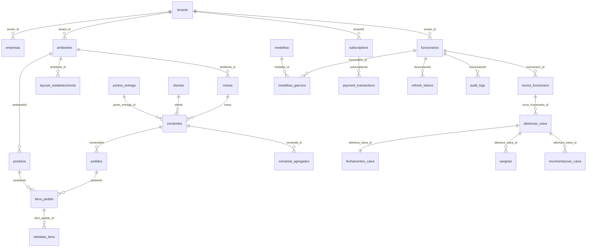

# Schema do Banco de Dados — Pub System

**Versao:** 2.0
**Atualizado:** 2026-03-06
**Fonte da verdade:** Este documento substitui a versao anterior (baseada em `empresaId`)
**Auditoria:** `docs/audits/database-audit.md`

---

## 1. Visao Geral

- **Banco:** PostgreSQL 17
- **Schema:** `public`
- **ORM:** TypeORM (NestJS)
- **Isolamento:** Multi-tenant via coluna `tenant_id` (UUID) em todas as entidades operacionais
- **PKs:** UUID v4 gerado por `uuid-ossp`
- **Naming:** Tabelas em **plural** snake_case (`funcionarios`, `itens_pedido`)

---

## 2. Todas as Tabelas (30)

### 2.1 Tabela Central — Tenants

| Coluna | Tipo | Nullable | Default | Descricao |
|--------|------|----------|---------|-----------|
| `id` | uuid PK | NAO | gen_random_uuid | ID do tenant |
| `nome` | varchar(255) | NAO | — | Nome do estabelecimento |
| `slug` | varchar(100) UNIQUE | NAO | — | Slug para URL/subdominio |
| `cnpj` | varchar(18) | SIM | — | CNPJ |
| `status` | enum | NAO | ATIVO | ATIVO, INATIVO, SUSPENSO, TRIAL |
| `plano` | enum | NAO | FREE | FREE, BASIC, PRO, ENTERPRISE |
| `config` | jsonb | SIM | — | Configuracoes (limites, modulos, cores, logo, gateways) |
| `created_at` | timestamp | NAO | now() | Criacao |
| `updated_at` | timestamp | NAO | now() | Atualizacao |

**Indices:** `idx_tenants_slug` (UNIQUE), `idx_tenants_status`

---

### 2.2 Tabelas Operacionais (24) — com tenant_id

Todas estas tabelas possuem a coluna:

| Coluna | Tipo | Status Atual | Status Correto |
|--------|------|-------------|----------------|
| `tenant_id` | uuid | **nullable: true, SEM FK** | NOT NULL + FK → tenants(id) CASCADE |

#### empresas

| Coluna | Tipo | Nullable | Descricao |
|--------|------|----------|-----------|
| `id` | uuid PK | NAO | — |
| `cnpj` | varchar UNIQUE | SIM | CNPJ |
| `nomeFantasia` | varchar | NAO | Nome fantasia |
| `razaoSocial` | varchar | NAO | Razao social |
| `telefone` | varchar | SIM | — |
| `endereco` | varchar | SIM | — |
| `slug` | varchar(100) UNIQUE | SIM | Slug URL |
| `ativo` | boolean | NAO | true | Status |
| `tenant_id` | uuid | SIM | Tenant |

**Indices:** `idx_empresas_slug` (UNIQUE), `idx_empresa_tenant_id`

#### funcionarios

| Coluna | Tipo | Nullable | Descricao |
|--------|------|----------|-----------|
| `id` | uuid PK | NAO | — |
| `nome` | varchar | NAO | Nome |
| `email` | varchar | NAO | Email |
| `senha` | varchar | NAO | Hash bcrypt |
| `cargo` | enum | NAO | ADMIN, GERENTE, CAIXA, GARCOM, COZINHEIRO, BARTENDER |
| `status` | enum | NAO | ATIVO, INATIVO |
| `telefone` | varchar | SIM | — |
| `endereco` | varchar | SIM | — |
| `foto_url` | varchar | SIM | URL da foto |
| `empresa_id` | uuid FK | SIM | **LEGADO** → empresas (SET NULL) |
| `ambiente_id` | uuid FK | SIM | → ambientes (SET NULL) |
| `tenant_id` | uuid | SIM | Tenant |

**Indices:** `idx_funcionario_email_tenant` (UNIQUE composto), `idx_funcionario_email`, `idx_funcionario_tenant_id`

#### ambientes

| Coluna | Tipo | Nullable | Descricao |
|--------|------|----------|-----------|
| `id` | uuid PK | NAO | — |
| `nome` | varchar(100) | NAO | Nome |
| `descricao` | text | SIM | — |
| `tipo` | enum | NAO | PREPARO, ATENDIMENTO |
| `is_ponto_de_retirada` | boolean | NAO | false |
| `tenant_id` | uuid | SIM | Tenant |

**Indices:** `idx_ambiente_nome_tenant` (UNIQUE composto), `idx_ambiente_tenant_id`
**Relacoes:** mesas (1:N), produtos (1:N)

#### mesas

| Coluna | Tipo | Nullable | Descricao |
|--------|------|----------|-----------|
| `id` | uuid PK | NAO | — |
| `numero` | int | NAO | Numero da mesa |
| `status` | enum | NAO | LIVRE, OCUPADA, RESERVADA, AGUARDANDO_PAGAMENTO |
| `posicao` | json | SIM | {x, y} para mapa visual |
| `tamanho` | json | SIM | {width, height} |
| `rotacao` | int | SIM | 0, 90, 180, 270 |
| `ambiente_id` | uuid FK | SIM | → ambientes |
| `tenant_id` | uuid | SIM | Tenant |

**Indices:** `idx_mesa_tenant_id`
**Constraints:** UNIQUE(numero, ambiente_id)

#### produtos

| Coluna | Tipo | Nullable | Descricao |
|--------|------|----------|-----------|
| `id` | uuid PK | NAO | — |
| `nome` | varchar | NAO | Nome |
| `descricao` | varchar | SIM | — |
| `preco` | decimal(10,2) | NAO | Preco |
| `categoria` | varchar | NAO | Categoria |
| `urlImagem` | varchar(512) | SIM | URL imagem |
| `ativo` | boolean | NAO | true |
| `ambienteId` | uuid FK | SIM | → ambientes |
| `tenant_id` | uuid | SIM | Tenant |

**Indices:** `idx_produto_tenant_id`

#### clientes

| Coluna | Tipo | Nullable | Descricao |
|--------|------|----------|-----------|
| `id` | uuid PK | NAO | — |
| `cpf` | varchar(14) **UNIQUE** | NAO | CPF (**BUG:** deveria ser unique por tenant) |
| `nome` | varchar | NAO | Nome |
| `email` | varchar | SIM | — |
| `celular` | varchar | SIM | — |
| `ambiente_id` | uuid FK | SIM | → ambientes (SET NULL) |
| `ponto_entrega_id` | uuid FK | SIM | → pontos_entrega (SET NULL) |
| `tenant_id` | uuid | SIM | Tenant |

**Indices:** `idx_cliente_cpf`, `idx_cliente_tenant_id`

#### comandas

| Coluna | Tipo | Nullable | Descricao |
|--------|------|----------|-----------|
| `id` | uuid PK | NAO | — |
| `status` | enum | NAO | ABERTA, FECHADA, PAGA |
| `dataAbertura` | timestamp | NAO | Auto (CreateDateColumn) |
| `mesa` | FK | SIM | → mesas (eager) |
| `cliente` | FK | SIM | → clientes (eager) |
| `ponto_entrega_id` | uuid FK | SIM | → pontos_entrega (eager) |
| `criado_por_id` | uuid FK | SIM | → funcionarios (SET NULL) |
| `criado_por_tipo` | varchar(20) | NAO | GARCOM ou CLIENTE |
| `paginaEvento` | FK | SIM | → paginas_evento (eager) |
| `tenant_id` | uuid | SIM | Tenant |

**Indices:** `idx_comanda_status`, `idx_comanda_data_abertura`, `idx_comanda_tenant_id`
**Relacoes:** pedidos (1:N), agregados (1:N CASCADE)

#### comanda_agregados

| Coluna | Tipo | Nullable | Descricao |
|--------|------|----------|-----------|
| `id` | uuid PK | NAO | — |
| `comanda_id` | uuid FK | NAO | → comandas (CASCADE) |
| `nome` | varchar(100) | NAO | Nome do agregado |
| `cpf` | varchar(11) | SIM | CPF |
| `ordem` | int | NAO | Ordem na comanda |
| `created_at` | timestamp | NAO | Auto |
| `tenant_id` | uuid | SIM | Tenant |

**Indices:** `idx_comanda_agregado_tenant_id`

#### pedidos

| Coluna | Tipo | Nullable | Descricao |
|--------|------|----------|-----------|
| `id` | uuid PK | NAO | — |
| `status` | enum | NAO | FEITO, EM_PREPARO, PRONTO, QUASE_PRONTO, ENTREGUE, RETIRADO, CANCELADO |
| `total` | decimal(10,2) | NAO | 0 |
| `data` | timestamp | NAO | Auto |
| `motivoCancelamento` | varchar(255) | SIM | — |
| `comandaId` | uuid FK | SIM | → comandas |
| `criado_por_id` | uuid FK | SIM | → funcionarios (SET NULL) |
| `criado_por_tipo` | varchar(20) | NAO | GARCOM ou CLIENTE |
| `entregue_por_id` | uuid FK | SIM | → funcionarios (SET NULL) |
| `entregue_em` | timestamp | SIM | — |
| `tempo_total_minutos` | int | SIM | Calculado |
| `tenant_id` | uuid | SIM | Tenant |

**Indices:** `idx_pedido_data`, `idx_pedido_tenant_id`
**Relacoes:** itens (1:N CASCADE eager)

#### itens_pedido

| Coluna | Tipo | Nullable | Descricao |
|--------|------|----------|-----------|
| `id` | uuid PK | NAO | — |
| `pedidoId` | uuid FK | NAO | → pedidos (CASCADE) |
| `produtoId` | uuid FK | SIM | → produtos (SET NULL) |
| `quantidade` | int | NAO | CHECK > 0 |
| `precoUnitario` | numeric(10,2) | NAO | — |
| `observacao` | varchar(255) | SIM | — |
| `status` | enum | NAO | Mesmo enum de PedidoStatus |
| `motivoCancelamento` | varchar(255) | SIM | — |
| `ambiente_retirada_id` | uuid FK | SIM | → ambientes (SET NULL) |
| `iniciadoEm` | timestamp | SIM | Inicio preparo |
| `prontoEm` | timestamp | SIM | — |
| `quase_pronto_em` | timestamp | SIM | — |
| `retirado_em` | timestamp | SIM | — |
| `entregueEm` | timestamp | SIM | — |
| `retirado_por_garcom_id` | uuid FK | SIM | → funcionarios (SET NULL) |
| `garcom_entrega_id` | uuid FK | SIM | → funcionarios (SET NULL) |
| `tempoentregaminutos` | int | SIM | — |
| `tempo_preparo_minutos` | int | SIM | — |
| `tempo_reacao_minutos` | int | SIM | — |
| `tempo_entrega_final_minutos` | int | SIM | — |
| `tenant_id` | uuid | SIM | Tenant |

**Indices:** `idx_item_pedido_status`, `idx_item_pedido_tenant_id`
**Constraints:** `chk_quantidade_positiva` (quantidade > 0)

#### retiradas_itens

| Coluna | Tipo | Nullable | Descricao |
|--------|------|----------|-----------|
| `id` | uuid PK | NAO | — |
| `item_pedido_id` | uuid FK | NAO | → itens_pedido (CASCADE) |
| `garcom_id` | uuid FK | NAO | → funcionarios (CASCADE eager) |
| `ambiente_id` | uuid FK | NAO | → ambientes (CASCADE eager) |
| `retirado_em` | timestamp | NAO | CURRENT_TIMESTAMP |
| `tempo_reacao_minutos` | int | SIM | — |
| `observacao` | text | SIM | — |
| `created_at` | timestamp | NAO | Auto |
| `tenant_id` | uuid | SIM | Tenant |

**Indices:** `idx_retirada_item_tenant_id`

#### pontos_entrega

| Coluna | Tipo | Nullable | Descricao |
|--------|------|----------|-----------|
| `id` | uuid PK | NAO | — |
| `nome` | varchar(100) | NAO | — |
| `descricao` | text | SIM | — |
| `ativo` | boolean | NAO | true |
| `posicao` | json | SIM | {x, y} |
| `tamanho` | json | SIM | {width, height} |
| `mesa_proxima_id` | uuid FK | SIM | → mesas (SET NULL) |
| `ambiente_atendimento_id` | uuid FK | SIM | → ambientes (RESTRICT) |
| `ambiente_preparo_id` | uuid FK | NAO | → ambientes (RESTRICT) |
| `empresa_id` | uuid FK | NAO | **LEGADO** → empresas (CASCADE) |
| `created_at` | timestamp | NAO | Auto |
| `updated_at` | timestamp | NAO | Auto |
| `tenant_id` | uuid | SIM | Tenant |

**Indices:** `idx_ponto_entrega_tenant_id`

#### eventos

| Coluna | Tipo | Nullable | Descricao |
|--------|------|----------|-----------|
| `id` | uuid PK | NAO | — |
| `titulo` | varchar | NAO | — |
| `descricao` | text | SIM | — |
| `dataEvento` | date | NAO | — |
| `valor` | decimal(10,2) | NAO | 0 (cover artistico) |
| `urlImagem` | varchar | SIM | — |
| `ativo` | boolean | NAO | true |
| `criado_em` | timestamp | NAO | Auto |
| `atualizado_em` | timestamp | NAO | Auto |
| `paginaEvento` | FK | SIM | → paginas_evento (eager) |
| `tenant_id` | uuid | SIM | Tenant |

**Indices:** `idx_evento_tenant_id`

#### paginas_evento

| Coluna | Tipo | Nullable | Descricao |
|--------|------|----------|-----------|
| `id` | uuid PK | NAO | — |
| `titulo` | varchar(100) | NAO | — |
| `url_imagem` | text | SIM | — |
| `ativa` | boolean | NAO | true |
| `criado_em` | timestamp | NAO | Auto |
| `atualizado_em` | timestamp | NAO | Auto |
| `tenant_id` | uuid | SIM | Tenant |

**Indices:** `idx_pagina_evento_tenant_id`

#### avaliacoes

| Coluna | Tipo | Nullable | Descricao |
|--------|------|----------|-----------|
| `id` | uuid PK | NAO | — |
| `comandaId` | uuid FK | NAO | → comandas |
| `clienteId` | uuid FK | SIM | → clientes |
| `nota` | int | NAO | 1-5 (sem CHECK) |
| `comentario` | text | SIM | — |
| `tempoEstadia` | int | SIM | Minutos |
| `valorGasto` | decimal(10,2) | NAO | — |
| `criadoEm` | timestamp | NAO | Auto |
| `tenant_id` | uuid | SIM | Tenant |

**Indices:** `idx_avaliacao_tenant_id`

#### turnos_funcionario

| Coluna | Tipo | Nullable | Descricao |
|--------|------|----------|-----------|
| `id` | uuid PK | NAO | — |
| `funcionario_id` | uuid FK | NAO | → funcionarios (CASCADE eager) |
| `checkIn` | timestamp | NAO | — |
| `checkOut` | timestamp | SIM | — |
| `horasTrabalhadas` | int | SIM | Minutos |
| `ativo` | boolean | NAO | true |
| `evento_id` | uuid FK | SIM | → eventos (eager) |
| `criadoEm` | timestamp | NAO | Auto |
| `tenant_id` | uuid | SIM | Tenant |

**Indices:** `idx_turno_funcionario_ativo` (composto: funcionarioId + ativo), `idx_turno_funcionario_tenant_id`

#### aberturas_caixa

| Coluna | Tipo | Nullable | Descricao |
|--------|------|----------|-----------|
| `id` | uuid PK | NAO | — |
| `turno_funcionario_id` | uuid FK | NAO | → turnos_funcionario (CASCADE eager) |
| `funcionario_id` | uuid FK | NAO | → funcionarios (CASCADE eager) |
| `dataAbertura` | date | NAO | — |
| `horaAbertura` | time | NAO | — |
| `valorInicial` | decimal(10,2) | NAO | 0 |
| `observacao` | text | SIM | — |
| `status` | enum | NAO | ABERTO, FECHADO, CONFERENCIA |
| `criadoEm` | timestamp | NAO | Auto |
| `atualizadoEm` | timestamp | NAO | Auto |
| `tenant_id` | uuid | SIM | Tenant |

**Indices:** `idx_abertura_caixa_tenant_id`
**Relacoes:** sangrias (1:N), movimentacoes (1:N)

#### fechamentos_caixa

| Coluna | Tipo | Nullable | Descricao |
|--------|------|----------|-----------|
| `id` | uuid PK | NAO | — |
| `abertura_caixa_id` | uuid FK | NAO | → aberturas_caixa (OneToOne eager) |
| `turno_funcionario_id` | uuid FK | NAO | → turnos_funcionario (CASCADE eager) |
| `funcionario_id` | uuid FK | NAO | → funcionarios (CASCADE eager) |
| `dataFechamento` | date | NAO | — |
| `horaFechamento` | time | NAO | — |
| `valorEsperado*` | decimal(10,2) x7 | NAO | Dinheiro, Pix, Debito, Credito, ValeRefeicao, ValeAlimentacao, Total |
| `valorInformado*` | decimal(10,2) x7 | NAO | Mesmos 7 campos |
| `diferenca*` | decimal(10,2) x7 | NAO | Mesmos 7 campos |
| `totalSangrias` | decimal(10,2) | NAO | 0 |
| `quantidadeSangrias` | int | NAO | 0 |
| `quantidadeVendas` | int | NAO | 0 |
| `quantidadeComandasFechadas` | int | NAO | 0 |
| `ticketMedio` | decimal(10,2) | NAO | 0 |
| `observacao` | text | SIM | — |
| `status` | enum | NAO | FECHADO |
| `criadoEm` | timestamp | NAO | Auto |
| `tenant_id` | uuid | SIM | Tenant |

**Indices:** `idx_fechamento_caixa_tenant_id`

#### movimentacoes_caixa

| Coluna | Tipo | Nullable | Descricao |
|--------|------|----------|-----------|
| `id` | uuid PK | NAO | — |
| `abertura_caixa_id` | uuid FK | NAO | → aberturas_caixa (eager) |
| `tipo` | enum | NAO | ABERTURA, VENDA, SANGRIA, SUPRIMENTO, FECHAMENTO |
| `data` | date | NAO | — |
| `hora` | time | NAO | — |
| `valor` | decimal(10,2) | NAO | — |
| `formaPagamento` | enum | SIM | DINHEIRO, PIX, DEBITO, CREDITO, VALE_REFEICAO, VALE_ALIMENTACAO |
| `descricao` | text | NAO | — |
| `funcionario_id` | uuid FK | NAO | → funcionarios (CASCADE eager) |
| `comanda_id` | varchar | SIM | ID da comanda (string) |
| `comanda_numero` | varchar | SIM | Numero visual |
| `criadoEm` | timestamp | NAO | Auto |
| `tenant_id` | uuid | SIM | Tenant |

**Indices:** `idx_movimentacao_data`, `idx_movimentacao_caixa_tenant_id`

#### sangrias

| Coluna | Tipo | Nullable | Descricao |
|--------|------|----------|-----------|
| `id` | uuid PK | NAO | — |
| `abertura_caixa_id` | uuid FK | NAO | → aberturas_caixa (eager) |
| `turno_funcionario_id` | uuid FK | NAO | → turnos_funcionario (CASCADE eager) |
| `funcionario_id` | uuid FK | NAO | → funcionarios (CASCADE eager) |
| `dataSangria` | date | NAO | — |
| `horaSangria` | time | NAO | — |
| `valor` | decimal(10,2) | NAO | — |
| `motivo` | varchar(255) | NAO | — |
| `observacao` | text | SIM | — |
| `autorizadoPor` | varchar(255) | SIM | Nome de quem autorizou |
| `autorizadoCargo` | varchar(50) | SIM | Cargo |
| `criadoEm` | timestamp | NAO | Auto |
| `tenant_id` | uuid | SIM | Tenant |

**Indices:** `idx_sangria_tenant_id`

#### medalhas

| Coluna | Tipo | Nullable | Descricao |
|--------|------|----------|-----------|
| `id` | uuid PK | NAO | — |
| `tipo` | enum | NAO | VELOCISTA, MARATONISTA, PONTUAL, MVP, CONSISTENTE |
| `nome` | varchar(100) | NAO | — |
| `descricao` | text | NAO | — |
| `icone` | varchar(50) | NAO | Emoji/icone |
| `nivel` | enum | NAO | BRONZE, PRATA, OURO |
| `requisitos` | jsonb | NAO | Criterios para conquista |
| `ativo` | boolean | NAO | true |
| `criado_em` | timestamp | NAO | Auto |
| `atualizado_em` | timestamp | NAO | Auto |
| `tenant_id` | uuid | SIM | Tenant |

**Indices:** `idx_medalha_tenant_id`

#### medalhas_garcons

| Coluna | Tipo | Nullable | Descricao |
|--------|------|----------|-----------|
| `id` | uuid PK | NAO | — |
| `funcionario_id` | uuid FK | NAO | → funcionarios (CASCADE) |
| `medalha_id` | uuid FK | NAO | → medalhas (CASCADE) |
| `conquistada_em` | timestamp | NAO | Auto |
| `metadata` | jsonb | SIM | Dados do momento da conquista |
| `tenant_id` | uuid | SIM | Tenant |

**Indices:** `idx_medalha_garcom_tenant_id`

#### audit_logs

| Coluna | Tipo | Nullable | Descricao |
|--------|------|----------|-----------|
| `id` | uuid PK | NAO | — |
| `funcionarioId` | uuid FK | SIM | → funcionarios (SET NULL) |
| `funcionarioEmail` | varchar(255) | SIM | Cache do email |
| `action` | enum | NAO | CREATE, UPDATE, DELETE, LOGIN, LOGOUT, LOGIN_FAILED, etc. |
| `entityName` | varchar(100) | NAO | Nome da entidade |
| `entityId` | uuid | SIM | ID do registro |
| `oldData` | jsonb | SIM | Dados anteriores |
| `newData` | jsonb | SIM | Dados novos |
| `ipAddress` | varchar(45) | SIM | IPv4/IPv6 |
| `userAgent` | text | SIM | — |
| `endpoint` | varchar(255) | SIM | — |
| `method` | varchar(10) | SIM | GET, POST, etc. |
| `description` | text | SIM | — |
| `createdAt` | timestamp | NAO | Auto |
| `tenant_id` | uuid | SIM | Tenant |

**Indices:** `idx_audit_log_tenant_id`, compostos: [funcionario, createdAt], [entityName, entityId], [action, createdAt], [createdAt]

#### layouts_estabelecimento

| Coluna | Tipo | Nullable | Descricao |
|--------|------|----------|-----------|
| `id` | uuid PK | NAO | — |
| `ambiente_id` | uuid FK | NAO | → ambientes |
| `width` | int | NAO | 1200 |
| `height` | int | NAO | 800 |
| `backgroundImage` | varchar | SIM | — |
| `gridSize` | int | NAO | 20 |
| `criadoEm` | timestamp | NAO | Auto |
| `atualizadoEm` | timestamp | NAO | Auto |
| `tenant_id` | uuid | SIM | Tenant |

**Indices:** `idx_layout_estabelecimento_tenant_id`

---

### 2.3 Tabelas Globais (sem tenant_id operacional)

#### plans

| Coluna | Tipo | Nullable | Descricao |
|--------|------|----------|-----------|
| `id` | uuid PK | NAO | — |
| `code` | varchar(50) UNIQUE | NAO | FREE, BASIC, PRO, ENTERPRISE |
| `name` | varchar(100) | NAO | Nome de exibicao |
| `description` | text | SIM | — |
| `priceMonthly` | decimal(10,2) | NAO | 0 |
| `priceYearly` | decimal(10,2) | NAO | 0 |
| `features` | jsonb | NAO | [] (lista de feature keys) |
| `limits` | jsonb | NAO | {} (maxMesas, maxFuncionarios, etc.) |
| `isActive` | boolean | NAO | true |
| `isPopular` | boolean | NAO | false |
| `sortOrder` | int | NAO | 0 |
| `metadata` | jsonb | SIM | — |
| `created_at` | timestamp | NAO | Auto |
| `updated_at` | timestamp | NAO | Auto |

**Indices:** `idx_plans_code` (UNIQUE)

#### payment_configs

| Coluna | Tipo | Nullable | Descricao |
|--------|------|----------|-----------|
| `id` | uuid PK | NAO | — |
| `gateway` | enum UNIQUE | NAO | mercado_pago, pagseguro, picpay |
| `enabled` | boolean | NAO | false |
| `sandbox` | boolean | NAO | false |
| `publicKey` | text | SIM | — |
| `accessToken` | text | SIM | — |
| `secretKey` | text | SIM | — |
| `webhookSecret` | text | SIM | — |
| `additionalConfig` | jsonb | SIM | — |
| `displayName` | varchar | SIM | — |
| `logoUrl` | varchar | SIM | — |
| `createdAt` | timestamp | NAO | Auto |
| `updatedAt` | timestamp | NAO | Auto |

#### subscriptions

| Coluna | Tipo | Nullable | Descricao |
|--------|------|----------|-----------|
| `id` | uuid PK | NAO | — |
| `tenantId` | uuid FK | **NAO** | → tenants (CASCADE) |
| `plano` | enum | NAO | FREE, BASIC, PRO, ENTERPRISE |
| `status` | enum | NAO | active, pending, cancelled, expired, trial |
| `billingCycle` | enum | NAO | monthly, yearly |
| `gateway` | enum | SIM | mercado_pago, pagseguro, picpay |
| `price` | decimal(10,2) | NAO | — |
| `externalSubscriptionId` | varchar | SIM | ID no gateway |
| `externalCustomerId` | varchar | SIM | — |
| `currentPeriodStart` | timestamp | SIM | — |
| `currentPeriodEnd` | timestamp | SIM | — |
| `trialEndsAt` | timestamp | SIM | — |
| `cancelledAt` | timestamp | SIM | — |
| `cancellationReason` | varchar | SIM | — |
| `metadata` | jsonb | SIM | — |
| `createdAt` | timestamp | NAO | Auto |
| `updatedAt` | timestamp | NAO | Auto |

#### payment_transactions

| Coluna | Tipo | Nullable | Descricao |
|--------|------|----------|-----------|
| `id` | uuid PK | NAO | — |
| `subscriptionId` | uuid FK | SIM | → subscriptions (SET NULL) |
| `tenantId` | uuid | **NAO** | Referencia ao tenant (sem FK) |
| `gateway` | enum | NAO | — |
| `type` | enum | NAO | subscription, upgrade, downgrade, renewal, refund |
| `status` | enum | NAO | pending |
| `amount` | decimal(10,2) | NAO | — |
| `currency` | varchar | NAO | BRL |
| `externalPaymentId` | varchar | SIM | — |
| `externalTransactionId` | varchar | SIM | — |
| `paymentMethod` | varchar | SIM | — |
| `description` | text | SIM | — |
| `failureReason` | text | SIM | — |
| `gatewayResponse` | jsonb | SIM | — |
| `metadata` | jsonb | SIM | — |
| `ipAddress` | varchar | SIM | — |
| `createdAt` | timestamp | NAO | Auto |
| `updatedAt` | timestamp | NAO | Auto |

#### refresh_tokens

| Coluna | Tipo | Nullable | Descricao |
|--------|------|----------|-----------|
| `id` | uuid PK | NAO | — |
| `token` | text | NAO | Token hash |
| `tenantId` | uuid | **SIM** | Isolamento (sem FK) |
| `funcionarioId` | uuid FK | NAO | → funcionarios (CASCADE) |
| `ipAddress` | varchar(45) | SIM | — |
| `userAgent` | text | SIM | — |
| `expiresAt` | timestamp | NAO | — |
| `revoked` | boolean | NAO | false |
| `revokedAt` | timestamp | SIM | — |
| `revokedByIp` | varchar(255) | SIM | — |
| `replacedByToken` | uuid | SIM | ID do token substituto |
| `createdAt` | timestamp | NAO | Auto |

**Indices:** `idx_refresh_token_tenant`, composto: [tenantId, funcionario]

---

## 3. Diagrama de Relacionamentos



---

## 4. Enums

| Enum | Valores | Tabela |
|------|---------|--------|
| TenantStatus | ATIVO, INATIVO, SUSPENSO, TRIAL | tenants |
| TenantPlano | FREE, BASIC, PRO, ENTERPRISE | tenants, subscriptions |
| Cargo | ADMIN, GERENTE, CAIXA, GARCOM, COZINHEIRO, BARTENDER | funcionarios |
| FuncionarioStatus | ATIVO, INATIVO | funcionarios |
| TipoAmbiente | PREPARO, ATENDIMENTO | ambientes |
| MesaStatus | LIVRE, OCUPADA, RESERVADA, AGUARDANDO_PAGAMENTO | mesas |
| ComandaStatus | ABERTA, FECHADA, PAGA | comandas |
| PedidoStatus | FEITO, EM_PREPARO, QUASE_PRONTO, PRONTO, RETIRADO, ENTREGUE, CANCELADO, DEIXADO_NO_AMBIENTE | pedidos, itens_pedido |
| StatusCaixa | ABERTO, FECHADO, CONFERENCIA | aberturas_caixa, fechamentos_caixa |
| TipoMovimentacao | ABERTURA, VENDA, SANGRIA, SUPRIMENTO, FECHAMENTO | movimentacoes_caixa |
| FormaPagamento | DINHEIRO, PIX, DEBITO, CREDITO, VALE_REFEICAO, VALE_ALIMENTACAO | movimentacoes_caixa |
| TipoMedalha | VELOCISTA, MARATONISTA, PONTUAL, MVP, CONSISTENTE | medalhas |
| NivelMedalha | BRONZE, PRATA, OURO | medalhas |
| AuditAction | CREATE, UPDATE, DELETE, LOGIN, LOGOUT, LOGIN_FAILED, PASSWORD_CHANGE, PERMISSION_CHANGE, EXPORT, IMPORT, ACCESS_DENIED | audit_logs |
| PaymentGateway | mercado_pago, pagseguro, picpay | payment_configs, subscriptions, payment_transactions |
| SubscriptionStatus | active, pending, cancelled, expired, trial | subscriptions |
| BillingCycle | monthly, yearly | subscriptions |
| TransactionStatus | pending, approved, rejected, refunded, cancelled, in_process | payment_transactions |
| TransactionType | subscription, upgrade, downgrade, renewal, refund | payment_transactions |

---

## 5. Extensoes PostgreSQL

- `uuid-ossp` — Geracao de UUIDs v4

---

## 6. Comandos de Inspecao

```bash
# Listar tabelas
docker exec -it pub-postgres psql -U pubuser -d pubsystem -c '\dt'

# Descrever tabela especifica
docker exec -it pub-postgres psql -U pubuser -d pubsystem -c '\d funcionarios'

# Contar registros por tabela
docker exec -it pub-postgres psql -U pubuser -d pubsystem -c "
  SELECT schemaname, relname, n_live_tup
  FROM pg_stat_user_tables
  ORDER BY n_live_tup DESC;
"

# Verificar indices
docker exec -it pub-postgres psql -U pubuser -d pubsystem -c "
  SELECT tablename, indexname, indexdef
  FROM pg_indexes
  WHERE schemaname = 'public'
  ORDER BY tablename;
"

# Verificar FKs
docker exec -it pub-postgres psql -U pubuser -d pubsystem -c "
  SELECT conname, conrelid::regclass, confrelid::regclass
  FROM pg_constraint
  WHERE contype = 'f'
  ORDER BY conrelid::regclass;
"

# Verificar registros sem tenant_id
docker exec -it pub-postgres psql -U pubuser -d pubsystem -c "
  SELECT 'ambientes' as tabela, count(*) FROM ambientes WHERE tenant_id IS NULL
  UNION ALL
  SELECT 'funcionarios', count(*) FROM funcionarios WHERE tenant_id IS NULL
  UNION ALL
  SELECT 'comandas', count(*) FROM comandas WHERE tenant_id IS NULL
  UNION ALL
  SELECT 'pedidos', count(*) FROM pedidos WHERE tenant_id IS NULL;
"
```

---

## 7. Vulnerabilidades Conhecidas

| # | Problema | Severidade | Detalhes em |
|---|---------|-----------|-------------|
| 1 | tenant_id nullable em 24 tabelas | CRITICO | `docs/audits/database-audit.md` §2.1 |
| 2 | Zero FKs tenant_id → tenants | CRITICO | `docs/audits/database-audit.md` §2.2 |
| 3 | TenantAwareEntity nao usada | CRITICO | `docs/audits/database-audit.md` §2.3 |
| 4 | Cliente.cpf UNIQUE global | ALTO | `docs/audits/database-audit.md` §2.5 |
| 5 | Faltam indices compostos | ALTO | `docs/audits/database-audit.md` §4.2 |
| 6 | empresaId legado em 2 tabelas | ALTO | `docs/audits/database-audit.md` §2.4 |
