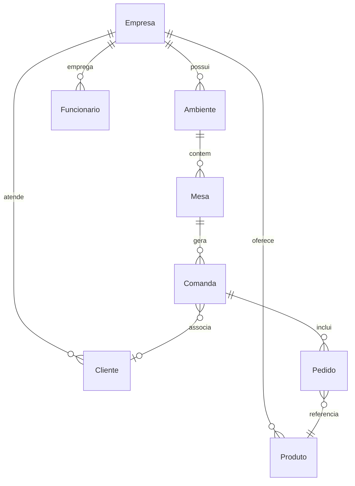

# Schema do Banco de Dados

## Visao Geral

O banco `pubsystem` usa o schema `public` com todas as tabelas. O isolamento multi-tenant e feito via coluna `empresaId` presente em todas as entidades principais.

## Entidades Principais

| Entidade | Tabela | Descricao |
|----------|--------|-----------|
| Empresa | `empresa` | Tenant principal (pub/restaurante) |
| Funcionario | `funcionario` | Usuarios do sistema (admin, garcom, caixa, cozinha) |
| Ambiente | `ambiente` | Areas fisicas (Salao, Varanda, etc.) |
| Mesa | `mesa` | Mesas dentro de ambientes |
| Comanda | `comanda` | Comanda aberta por mesa/cliente |
| Pedido | `pedido` | Itens pedidos dentro de uma comanda |
| Produto | `produto` | Itens do cardapio |
| Cliente | `cliente` | Clientes cadastrados |
| PontoEntrega | `ponto_entrega` | Pontos de retirada/entrega |
| Evento | `evento` | Eventos do estabelecimento |
| PaginaEvento | `pagina_evento` | Paginas publicas de eventos |
| Avaliacao | `avaliacao` | Avaliacoes de clientes |
| Turno | `turno` | Turnos de trabalho |
| Medalha | `medalha` | Sistema de gamificacao |
| Caixa | `caixa` | Registros de caixa |
| Audit | `audit_log` | Log de auditoria |

## Relacionamentos Principais



## Colunas Comuns

Todas as entidades com isolamento multi-tenant possuem:

| Coluna | Tipo | Descricao |
|--------|------|-----------|
| `id` | UUID | Chave primaria (uuid-ossp) |
| `empresaId` | UUID | FK para empresa (tenant) |
| `criadoEm` | timestamp | Data de criacao |
| `atualizadoEm` | timestamp | Data da ultima atualizacao |

## Extensoes

- `uuid-ossp`: geracao de UUIDs

## Inspecao

```bash
# Listar tabelas
docker exec -it pub-postgres psql -U pubuser -d pubsystem -c '\dt'

# Descrever tabela especifica
docker exec -it pub-postgres psql -U pubuser -d pubsystem -c '\d empresa'

# Contar registros por tabela
docker exec -it pub-postgres psql -U pubuser -d pubsystem -c "
  SELECT schemaname, relname, n_live_tup
  FROM pg_stat_user_tables
  ORDER BY n_live_tup DESC;
"
```
