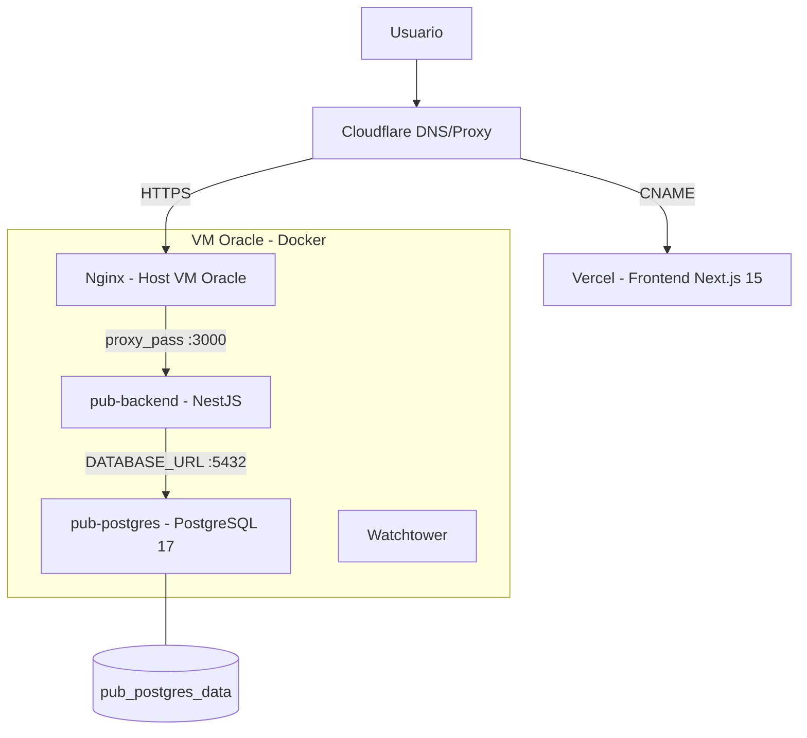

# Arquitetura Atual

## Visao Geral

O Pub System opera em arquitetura hibrida com os seguintes componentes:

- **Frontend**: Next.js 15 hospedado na Vercel
- **Backend**: NestJS em container Docker na VM Oracle (Always Free)
- **Banco de dados**: PostgreSQL 17 em container Docker na mesma VM
- **Proxy reverso**: Nginx instalado no host da VM
- **DNS/WAF**: Cloudflare com proxy ativo
- **Auto-update**: Watchtower monitora e atualiza imagens Docker

## Diagrama

## Rede Docker

| Servico | Container | Porta Interna | Porta Exposta |
|---------|-----------|---------------|---------------|
| Backend | pub-backend | 3000 | 3000 |
| Banco | pub-postgres | 5432 | 5432 |
| Watchtower | watchtower | - | - |

Rede bridge: `pub-system_default` (gerada automaticamente pelo Compose).

O Nginx no host se comunica com `pub-backend` via `localhost:3000` (porta mapeada).

## Fluxo de Requisicao

1. Cliente acessa `pubsystem.com.br` ou `api.pubsystem.com.br`
2. Cloudflare resolve DNS e aplica regras de proxy/WAF
3. Para o frontend: Cloudflare redireciona para Vercel via CNAME
4. Para a API: Cloudflare encaminha para o IP publico da VM Oracle
5. Nginx recebe na porta 443 e faz proxy para `localhost:3000`
6. O container `pub-backend` processa a requisicao
7. Acessa o banco via `DATABASE_URL` apontando para `pub-postgres:5432`
8. Dados persistidos no volume `pub_postgres_data`

## Variaveis de Ambiente Obrigatorias

| Variavel | Descricao |
|----------|-----------|
| `DATABASE_URL` | String de conexao PostgreSQL (usuario/senha/host/porta/db) |
| `DB_SSL` | `false` (banco na mesma rede Docker, sem SSL) |
| `JWT_SECRET` | Segredo para assinatura de tokens (minimo 32 caracteres) |
| `ADMIN_EMAIL` | Email da conta administradora inicial |
| `ADMIN_SENHA` | Senha da conta administradora inicial |
| `BACKEND_URL` | URL publica da API (ex: `https://api.pubsystem.com.br`) |
| `FRONTEND_URL` | URL do frontend para CORS e redirects |
| `POSTGRES_USER` | Usuario criado na inicializacao do container |
| `POSTGRES_PASSWORD` | Senha do usuario acima |
| `POSTGRES_DB` | Nome do banco criado na inicializacao |

## Custos

| Componente | Servico | Custo |
|------------|---------|-------|
| VM | Oracle Always Free (E2.1.Micro) | Gratuito |
| Frontend | Vercel Hobby | Gratuito |
| DNS/SSL | Cloudflare Free | Gratuito |
| Banco | PostgreSQL 17 local (Docker) | Gratuito |
